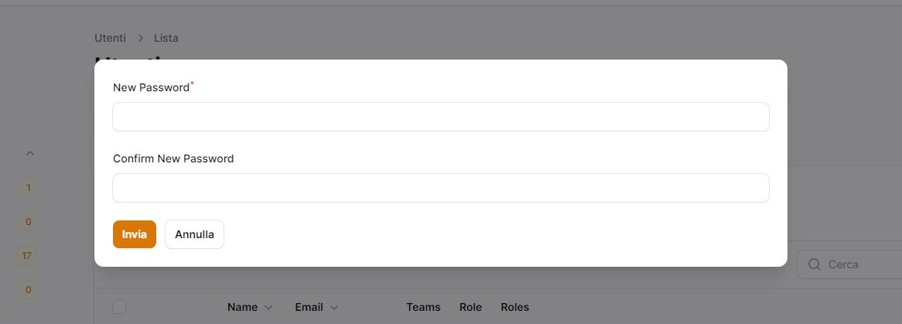
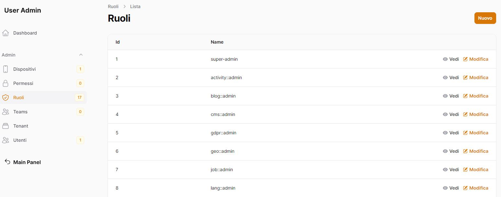

<<<<<<< HEAD
<<<<<<< HEAD
<<<<<<< HEAD
<<<<<<< HEAD
<<<<<<< HEAD
<<<<<<< HEAD
<<<<<<< HEAD
<<<<<<< HEAD
<<<<<<< HEAD
<<<<<<< HEAD
<<<<<<< HEAD
<<<<<<< HEAD
<<<<<<< HEAD
<<<<<<< HEAD
<<<<<<< HEAD
<<<<<<< HEAD
<<<<<<< HEAD
<<<<<<< HEAD
<<<<<<< HEAD
<<<<<<< HEAD
<<<<<<< HEAD
<<<<<<< HEAD
<<<<<<< HEAD
<<<<<<< HEAD
<<<<<<< HEAD
<<<<<<< HEAD
<<<<<<< HEAD
<<<<<<< HEAD
<<<<<<< HEAD
<<<<<<< HEAD
<<<<<<< HEAD
<<<<<<< HEAD
<<<<<<< HEAD
<<<<<<< HEAD
<<<<<<< HEAD

<<<<<<< HEAD
<<<<<<< HEAD
<<<<<<< HEAD
=======
>>>>>>> 4f97354 (.)
=======
>>>>>>> 829c80f (.)
# BashScripts - Organizzazione Script
<<<<<<< HEAD
<<<<<<< HEAD
=======
<<<<<<< HEAD
<<<<<<< HEAD
=======
>>>>>>> 829c80f (.)
=======
<<<<<<< HEAD
<<<<<<< HEAD
# BashScripts - Organizzazione Script

## Regola Fondamentale

**TUTTI gli script** (PHP, Bash, Python, etc.) devono essere posizionati **SEMPRE** in questa cartella `bashscripts`, **MAI** nella directory Laravel o in altre posizioni.

## Struttura Organizzativa

```bashscripts/
├── README.md                    # Questo file
├── database/                    # Script relativi al database
│   ├── seeding/                # Script per popolamento database
│   │   ├── saluteora-1000-records.php        # 🎯 PRINCIPALE: 1000 record per modello
│   │   ├── saluteora-20-studios-66010.php    # 🆕 NUOVO: 20 studi con postal_code 66010 + dottori
│   │   ├── saluteora-mass-seeding.php         # Popolamento massivo SaluteOra
│   │   ├── salutemo-database-seeding.php      # Popolamento SaluteMo
│   │   ├── tinker-commands.php                 # Comandi per Tinker
│   │   ├── tinker-1000-records.php            # Script Tinker per 1000 record
│   │   ├── tinker-20-studios-66010.php        # 🆕 Script Tinker per 20 studi + dottori
│   │   └── QUICK_START.md                     # Guida rapida all'utilizzo
│   ├── migration/              # Script per gestione migrazioni
│   └── backup/                 # Script per backup database
├── maintenance/                 # Script di manutenzione
│   ├── cleanup/                # Script di pulizia
│   └── optimization/           # Script di ottimizzazione
├── deployment/                  # Script di deployment
│   ├── staging/                # Script per ambiente staging
│   └── production/             # Script per ambiente produzione
└── utilities/                   # Script di utilità generale
    ├── monitoring/              # Script di monitoraggio
    └── reporting/               # Script di reporting
```

## Script di Seeding Database

### 🎯 **Script Principale: 1000 Record per Modello**
- **`saluteora-1000-records.php`**: Genera esattamente 1000 doctor, 1000 patients, 1000 studios e 500 appointments
- **`tinker-1000-records.php`**: Versione semplificata per Tinker

### 🆕 **Script Specializzato: 20 Studi con Postal Code 66010**
- **`saluteora-20-studios-66010.php`**: Crea 20 studi medici con postal_code = '66010' e **garantisce che ogni studio abbia almeno un dottore collegato**
- **`tinker-20-studios-66010.php`**: Versione Tinker per 20 studi + dottori

**Caratteristiche principali:**
- 🎯 **20 studi medici** con postal_code fisso 66010 (Chieti, Abruzzo)
- 👨‍⚕️ **Almeno 1 dottore** per ogni studio (garantito)
- 🏥 **Nomi specializzati** per ogni studio (Cardiologico, Ortopedico, etc.)
- 📍 **Indirizzi realistici** nella zona di Chieti
- 🔗 **Relazioni automatiche** tra studi e dottori
- ✅ **Verifica finale** che ogni studio abbia dottori

### **Script Generali**
- **`saluteora-mass-seeding.php`**: Popolamento massivo generale
- **`salutemo-database-seeding.php`**: Popolamento modulo SaluteMo
- **`tinker-commands.php`**: Comandi generali per Tinker

## Utilizzo degli Script

### Esecuzione Diretta (Raccomandata)

```bash
# Dalla root del progetto
cd /var/www/html/_bases/base_saluteora

# Script per 20 studi con dottori (RACCOMANDATO per iniziare)
php bashscripts/database/seeding/saluteora-20-studios-66010.php

# Script per 1000 record per modello
php bashscripts/database/seeding/saluteora-1000-records.php
```

### Esecuzione via Tinker

```bash
# Dalla directory Laravel
cd laravel

# Avvia Tinker
php artisan tinker

# Incolla il contenuto dello script desiderato
# Lo script si eseguirà automaticamente
```

## Caratteristiche degli Script

### Gestione Relazioni Garantite
- **Studio ↔ Doctor**: Ogni studio ha almeno un dottore
- **Doctor ↔ Appointment**: Appuntamenti collegati ai dottori
- **Patient ↔ Appointment**: Pazienti collegati agli appuntamenti

### Dati Realistici e Specializzati
- **Nomi italiani** per dottori e pazienti
- **Indirizzi reali** nella zona di Chieti (66010)
- **Specializzazioni mediche** specifiche per ogni studio
- **Contatti e orari** realistici per studi medici

### Performance e Sicurezza
- **Creazione in batch** per grandi volumi
- **Disabilitazione foreign key** durante il seeding
- **Transazioni ottimizzate** per consistenza
- **Verifica automatica** dell'integrità dei dati

## Esempi di Output

### Script 20 Studi con Dottori

```bash
🏥 Creazione 20 studi medici con postal_code = 66010 e dottori collegati...
✅ Studio creato: Centro Medico Chieti Centro (ID: 1)
✅ Studio creato: Studio Dentistico Chieti Nord (ID: 2)
...
👨‍⚕️ Dottore creato: Dr. Mario Rossi - Cardiologia per studio Centro Medico Chieti Centro
👨‍⚕️ Dottore creato: Dr. Anna Bianchi - Dermatologia per studio Studio Dentistico Chieti Nord
...
✅ SUCCESSO: Tutti gli studi hanno almeno un dottore collegato!
```

### Script 1000 Record

```bash
🚀 Inizializzazione seeding massivo SaluteOra - 1000 record per modello...
📊 RISULTATO FINALE:
  - Studi creati: 1000
  - Dottori totali: 1000
  - Pazienti totali: 1000
  - Appuntamenti totali: 500
```

## Documentazione Correlata

- [Database Seeding](../docs/database-seeding.md) - Documentazione completa seeding
- [Organizzazione Script](../docs/script-organization.md) - Regole generali script
- [Quick Start Seeding](database/seeding/QUICK_START.md) - Guida rapida all'utilizzo

## Best Practices

### Prima dell'Esecuzione
- Backup del database esistente
- Verifica spazio disco disponibile
- Controllo configurazione ambiente
- Test su ambiente di sviluppo

### Durante l'Esecuzione
- Monitorare output e progressi
- Verificare statistiche intermedie
- Controllare utilizzo risorse
- Gestire eventuali errori

### Dopo l'Esecuzione
- Verificare integrità relazioni
- Controllare statistiche finali
- Testare funzionalità applicazione
- Documentare modifiche effettuate

## Troubleshooting

### Errori Comuni
1. **Modulo non trovato**: Verificare installazione modulo SaluteOra
2. **Factory non trovato**: Controllare esistenza factory nel modulo
3. **Errore database**: Verificare migrazioni e configurazione
4. **Memoria insufficiente**: Utilizzare script in batch più piccoli

### Soluzioni
1. **Eseguire migrazioni**: `php artisan migrate`
2. **Verificare autoload**: `composer dump-autoload`
3. **Controllare namespace**: Verificare struttura moduli
4. **Testare connessione**: Verificare configurazione database

## Note Importanti

- **Regola fondamentale**: Script SEMPRE in `bashscripts/`, MAI in `laravel/`
- **Categorizzazione**: Organizzare script per funzionalità e modulo
- **Documentazione**: Aggiornare sempre docs e README
- **Testing**: Testare sempre in ambiente di sviluppo prima della produzione

---

**Ultimo aggiornamento**: Gennaio 2025
**Versione**: 2.0
**Compatibilità**: Laravel 10+, Moduli SaluteOra/SaluteMo
=======
=======
>>>>>>> f198176d (.)
>>>>>>> e0c964a3 (first)
<<<<<<< HEAD
=======
>>>>>>> 4f97354 (.)
=======
>>>>>>> 829c80f (.)
# 🚀 Toolkit di Automazione Git per Laraxot PTVX

[](../docs/phpstan/ANALISI_MODULI_PHPSTAN.md)
[](https://www.gnu.org/software/bash/)
[](LICENSE)
[](https://github.com/aurmich/bashscripts_fila3)
[](http://makeapullrequest.com)

<div align="center">
  
  <br/>
  <strong>Potenti script Bash per la gestione avanzata dei subtree Git 🌳</strong>
</div>

## 🌟 Caratteristiche Principali

- 🔄 **Sincronizzazione Automatica** dei subtree Git
- 🛡️ **Gestione Robusta degli Errori**
- 🔍 **Logging Dettagliato**
- 🚦 **Controlli di Sicurezza** integrati
- 🔧 **Manutenzione Semplificata**

## 📚 Indice

- [Installazione](#-installazione)
- [Utilizzo](#-utilizzo)
- [Organizzazione Script](#-organizzazione-script)
- [Script Disponibili](#-script-disponibili)
- [Esempi](#-esempi)
- [Risoluzione Problemi](#-risoluzione-problemi)
- [Contribuire](#-contribuire)

## 💻 Installazione

```bash
# Clona il repository
git clone git@github.com:aurmich/bashscripts_fila3.git

# Rendi gli script eseguibili
<<<<<<< HEAD
<<<<<<< HEAD
<<<<<<< HEAD
=======
>>>>>>> 829c80f (.)
chmod +x *.sh
=======
<<<<<<< HEAD
=======
chmod +x *.sh
>>>>>>> 574afe9e (.)
>>>>>>> e0c964a3 (first)
<<<<<<< HEAD
=======
chmod +x *.sh
>>>>>>> 4f97354 (.)
=======
>>>>>>> 829c80f (.)
chmod +x scripts/**/*.sh
```

## 🚀 Utilizzo

### Sincronizzazione Subtree
```bash
<<<<<<< HEAD
<<<<<<< HEAD
<<<<<<< HEAD
=======
>>>>>>> 829c80f (.)
./git_sync_subtree.sh <path> <remote_repo>
=======
<<<<<<< HEAD
=======
./git_sync_subtree.sh <path> <remote_repo>
>>>>>>> 574afe9e (.)
>>>>>>> e0c964a3 (first)
<<<<<<< HEAD
=======
./git_sync_subtree.sh <path> <remote_repo>
>>>>>>> 4f97354 (.)
=======
>>>>>>> 829c80f (.)
./scripts/git/git_sync_subtree.sh <path> <remote_repo>
```

Esempio:
```bash
./scripts/git/git_sync_subtree.sh modules/auth git@github.com:user/auth-module.git
```

## 📁 Organizzazione Script

Tutti gli script sono organizzati in sottocartelle per categoria:

### 🔧 **scripts/git/** - Gestione Git e Subtree
- `git_sync_subtree.sh` - Sincronizzazione principale
- `resolve_git_conflict.sh` - Risoluzione conflitti
- `init-subtrees.sh` - Inizializzazione subtree
- `reset_subtrees.sh` - Reset subtree
- `sync_submodules.sh` - Sincronizzazione submodule
- `rebase_keep_last_commits.sh` - Rebase con mantenimento commit

### 📝 **scripts/docs/** - Gestione Documentazione
- `docs-audit-dry-kiss.sh` - Audit documentazione
- `docs-consolidation.sh` - Consolidamento docs
- `docs-final-optimization.sh` - Ottimizzazione finale
- `fix-docs-naming.sh` - Correzione naming
- `organize_docs_structure.sh` - Organizzazione struttura
- `update_docs.sh` - Aggiornamento documentazione

### 🔍 **scripts/phpstan/** - Analisi Statiche
- `check_before_phpstan.sh` - Controlli pre-PHPStan
- `create_phpstan_readme.sh` - Generazione README PHPStan
- `generate_phpstan_summary.sh` - Riassunto PHPStan
- `phpstan_docs_generator.sh` - Generatore documentazione
- `fix-translations.php` - Correzione traduzioni

### 💾 **scripts/backup/** - Backup e Sincronizzazione
- `backup.sh` - Script di backup
- `sync_to_disk.sh` - Sincronizzazione su disco
- `copy_to_mono.sh` - Copia in repository monolitico

### 🔧 **scripts/fix/** - Correzioni e Riparazioni
- `fix_errors.sh` - Correzione errori
- `fix_structure.sh` - Correzione struttura
- `fix_directory_structure.sh` - Correzione struttura directory
- `fix-psr4-autoloading-violations.sh` - Correzione PSR-4

### 🧪 **scripts/testing/** - Test e Validazione
- `check_form_schema.php` - Controllo schema form
- `check_mysql.sh` - Controllo MySQL
- `test_parse.sh` - Test parsing
- `phpunit.xml` - Configurazione PHPUnit

### ⚙️ **scripts/config/** - Configurazioni
- `package.json` - Configurazione Node.js
- `postcss.config.js` - Configurazione PostCSS
- `tailwind.config.js` - Configurazione Tailwind
- `rector.php` - Configurazione Rector
- `mysql-db-connector.js` - Connettore MySQL

### 🛠️ **scripts/utils/** - Utility e Helper
- `parse_gitmodules_ini.sh` - Parsing gitmodules
- `check_mcp_config.php` - Controllo configurazione MCP
- `tips.txt` - Suggerimenti e trucchi
- `prompt.txt` - Prompt e template
- `organize_files.sh` - Organizzazione file

## 📜 Script Disponibili

### 1. Git Management (scripts/git/)
> 🎯 Script per la gestione Git e subtree
./git_sync_subtree.sh modules/auth git@github.com:user/auth-module.git
```

## 📜 Script Disponibili

### 1. git_sync_subtree.sh
> 🎯 Script principale per la sincronizzazione dei subtree

**Caratteristiche:**
- Gestione automatica di push e pull
- Rimozione caratteri CR (^M)
- Gestione permessi automatica

### 2. Documentation Management (scripts/docs/)
> 📝 Script per la gestione della documentazione

**Funzionalità:**
- Audit automatico della documentazione
- Consolidamento e ottimizzazione
- Correzione naming conventions

### 3. PHPStan Analysis (scripts/phpstan/)
> 🔍 Script per analisi statiche

**Caratteristiche:**
- Controlli pre-PHPStan
- Generazione documentazione automatica
- Correzione traduzioni

### 4. Backup & Sync (scripts/backup/)
> 💾 Script per backup e sincronizzazione

**Funzionalità:**
- Backup automatico
- Sincronizzazione su disco
- Copia in repository monolitico

### 5. Fix & Repair (scripts/fix/)
> 🔧 Script per correzioni e riparazioni

**Caratteristiche:**
- Correzione errori automatica
- Riparazione struttura
- Correzione violazioni PSR-4

### 2. git_push_subtree.sh
> 🔼 Gestisce le operazioni di push

**Funzionalità:**
- Push intelligente con fallback
- Gestione branch temporanei
- Rebase automatico

### 3. git_pull_subtree.sh
> 🔽 Gestisce le operazioni di pull

**Caratteristiche:**
- Pull con squash opzionale
- Gestione conflitti automatica
- Merge strategy personalizzabile

## 🎯 Esempi

### Sincronizzazione Modulo
```bash
<<<<<<< HEAD
<<<<<<< HEAD
<<<<<<< HEAD
=======
>>>>>>> 4f97354 (.)
=======
>>>>>>> 829c80f (.)
=======
<<<<<<< HEAD
<<<<<<< HEAD
=======
>>>>>>> ea169dcc (.)

## Regola Fondamentale

**TUTTI gli script** (PHP, Bash, Python, etc.) devono essere posizionati **SEMPRE** in questa cartella `bashscripts`, **MAI** nella directory Laravel o in altre posizioni.

## Struttura Organizzativa

```bashscripts/
├── README.md                    # Questo file
├── database/                    # Script relativi al database
│   ├── seeding/                # Script per popolamento database
│   │   ├── saluteora-1000-records.php        # 🎯 PRINCIPALE: 1000 record per modello
│   │   ├── saluteora-20-studios-66010.php    # 🆕 NUOVO: 20 studi con postal_code 66010 + dottori
│   │   ├── saluteora-mass-seeding.php         # Popolamento massivo SaluteOra
│   │   ├── salutemo-database-seeding.php      # Popolamento SaluteMo
│   │   ├── tinker-commands.php                 # Comandi per Tinker
│   │   ├── tinker-1000-records.php            # Script Tinker per 1000 record
│   │   ├── tinker-20-studios-66010.php        # 🆕 Script Tinker per 20 studi + dottori
│   │   └── QUICK_START.md                     # Guida rapida all'utilizzo
│   ├── migration/              # Script per gestione migrazioni
│   └── backup/                 # Script per backup database
├── maintenance/                 # Script di manutenzione
│   ├── cleanup/                # Script di pulizia
│   └── optimization/           # Script di ottimizzazione
├── deployment/                  # Script di deployment
│   ├── staging/                # Script per ambiente staging
│   └── production/             # Script per ambiente produzione
└── utilities/                   # Script di utilità generale
    ├── monitoring/              # Script di monitoraggio
    └── reporting/               # Script di reporting
```

## Script di Seeding Database

### 🎯 **Script Principale: 1000 Record per Modello**
- **`saluteora-1000-records.php`**: Genera esattamente 1000 doctor, 1000 patients, 1000 studios e 500 appointments
- **`tinker-1000-records.php`**: Versione semplificata per Tinker

### 🆕 **Script Specializzato: 20 Studi con Postal Code 66010**
- **`saluteora-20-studios-66010.php`**: Crea 20 studi medici con postal_code = '66010' e **garantisce che ogni studio abbia almeno un dottore collegato**
- **`tinker-20-studios-66010.php`**: Versione Tinker per 20 studi + dottori

**Caratteristiche principali:**
- 🎯 **20 studi medici** con postal_code fisso 66010 (Chieti, Abruzzo)
- 👨‍⚕️ **Almeno 1 dottore** per ogni studio (garantito)
- 🏥 **Nomi specializzati** per ogni studio (Cardiologico, Ortopedico, etc.)
- 📍 **Indirizzi realistici** nella zona di Chieti
- 🔗 **Relazioni automatiche** tra studi e dottori
- ✅ **Verifica finale** che ogni studio abbia dottori

### **Script Generali**
- **`saluteora-mass-seeding.php`**: Popolamento massivo generale
- **`salutemo-database-seeding.php`**: Popolamento modulo SaluteMo
- **`tinker-commands.php`**: Comandi generali per Tinker

## Utilizzo degli Script

### Esecuzione Diretta (Raccomandata)

```bash
# Dalla root del progetto
cd /var/www/html/_bases/base_saluteora

<<<<<<< HEAD
<<<<<<< HEAD
=======
>>>>>>> ea169dcc (.)
# Script per 20 studi con dottori (RACCOMANDATO per iniziare)
php bashscripts/database/seeding/saluteora-20-studios-66010.php

# Script per 1000 record per modello
php bashscripts/database/seeding/saluteora-1000-records.php
<<<<<<< HEAD
=======
# Rendi gli script eseguibili
<<<<<<< HEAD
=======
chmod +x *.sh
>>>>>>> 574afe9e (.)
chmod +x scripts/**/*.sh
>>>>>>> 7de7063d (.)
=======
>>>>>>> ea169dcc (.)
```

### Esecuzione via Tinker

```bash
<<<<<<< HEAD
<<<<<<< HEAD
=======
>>>>>>> ea169dcc (.)
# Dalla directory Laravel
cd laravel

# Avvia Tinker
php artisan tinker

# Incolla il contenuto dello script desiderato
# Lo script si eseguirà automaticamente
<<<<<<< HEAD
=======
<<<<<<< HEAD
=======
./git_sync_subtree.sh <path> <remote_repo>
>>>>>>> 574afe9e (.)
./scripts/git/git_sync_subtree.sh <path> <remote_repo>
>>>>>>> 7de7063d (.)
=======
>>>>>>> ea169dcc (.)
```

## Caratteristiche degli Script

### Gestione Relazioni Garantite
- **Studio ↔ Doctor**: Ogni studio ha almeno un dottore
- **Doctor ↔ Appointment**: Appuntamenti collegati ai dottori
- **Patient ↔ Appointment**: Pazienti collegati agli appuntamenti

### Dati Realistici e Specializzati
- **Nomi italiani** per dottori e pazienti
- **Indirizzi reali** nella zona di Chieti (66010)
- **Specializzazioni mediche** specifiche per ogni studio
- **Contatti e orari** realistici per studi medici

### Performance e Sicurezza
- **Creazione in batch** per grandi volumi
- **Disabilitazione foreign key** durante il seeding
- **Transazioni ottimizzate** per consistenza
- **Verifica automatica** dell'integrità dei dati

## Esempi di Output

### Script 20 Studi con Dottori

```bash
🏥 Creazione 20 studi medici con postal_code = 66010 e dottori collegati...
✅ Studio creato: Centro Medico Chieti Centro (ID: 1)
✅ Studio creato: Studio Dentistico Chieti Nord (ID: 2)
...
👨‍⚕️ Dottore creato: Dr. Mario Rossi - Cardiologia per studio Centro Medico Chieti Centro
👨‍⚕️ Dottore creato: Dr. Anna Bianchi - Dermatologia per studio Studio Dentistico Chieti Nord
...
✅ SUCCESSO: Tutti gli studi hanno almeno un dottore collegato!
```

### Script 1000 Record

```bash
<<<<<<< HEAD
<<<<<<< HEAD
=======
>>>>>>> ea169dcc (.)
🚀 Inizializzazione seeding massivo SaluteOra - 1000 record per modello...
📊 RISULTATO FINALE:
  - Studi creati: 1000
  - Dottori totali: 1000
  - Pazienti totali: 1000
  - Appuntamenti totali: 500
<<<<<<< HEAD
=======
<<<<<<< HEAD
=======
=======
>>>>>>> 71ff9e32 (.)
=======
=======
# 🚀 Toolkit di Automazione Git per Laraxot PTVX
>>>>>>> develop

## Regola Fondamentale

**TUTTI gli script** (PHP, Bash, Python, etc.) devono essere posizionati **SEMPRE** in questa cartella `bashscripts`, **MAI** nella directory Laravel o in altre posizioni.

## Struttura Organizzativa

```bashscripts/
├── README.md                    # Questo file
├── database/                    # Script relativi al database
│   ├── seeding/                # Script per popolamento database
│   │   ├── saluteora-1000-records.php        # 🎯 PRINCIPALE: 1000 record per modello
│   │   ├── saluteora-20-studios-66010.php    # 🆕 NUOVO: 20 studi con postal_code 66010 + dottori
│   │   ├── saluteora-mass-seeding.php         # Popolamento massivo SaluteOra
│   │   ├── salutemo-database-seeding.php      # Popolamento SaluteMo
│   │   ├── tinker-commands.php                 # Comandi per Tinker
│   │   ├── tinker-1000-records.php            # Script Tinker per 1000 record
│   │   ├── tinker-20-studios-66010.php        # 🆕 Script Tinker per 20 studi + dottori
│   │   └── QUICK_START.md                     # Guida rapida all'utilizzo
│   ├── migration/              # Script per gestione migrazioni
│   └── backup/                 # Script per backup database
├── maintenance/                 # Script di manutenzione
│   ├── cleanup/                # Script di pulizia
│   └── optimization/           # Script di ottimizzazione
├── deployment/                  # Script di deployment
│   ├── staging/                # Script per ambiente staging
│   └── production/             # Script per ambiente produzione
└── utilities/                   # Script di utilità generale
    ├── monitoring/              # Script di monitoraggio
    └── reporting/               # Script di reporting
```

## Script di Seeding Database

### 🎯 **Script Principale: 1000 Record per Modello**
- **`saluteora-1000-records.php`**: Genera esattamente 1000 doctor, 1000 patients, 1000 studios e 500 appointments
- **`tinker-1000-records.php`**: Versione semplificata per Tinker

### 🆕 **Script Specializzato: 20 Studi con Postal Code 66010**
- **`saluteora-20-studios-66010.php`**: Crea 20 studi medici con postal_code = '66010' e **garantisce che ogni studio abbia almeno un dottore collegato**
- **`tinker-20-studios-66010.php`**: Versione Tinker per 20 studi + dottori

**Caratteristiche principali:**
- 🎯 **20 studi medici** con postal_code fisso 66010 (Chieti, Abruzzo)
- 👨‍⚕️ **Almeno 1 dottore** per ogni studio (garantito)
- 🏥 **Nomi specializzati** per ogni studio (Cardiologico, Ortopedico, etc.)
- 📍 **Indirizzi realistici** nella zona di Chieti
- 🔗 **Relazioni automatiche** tra studi e dottori
- ✅ **Verifica finale** che ogni studio abbia dottori

### **Script Generali**
- **`saluteora-mass-seeding.php`**: Popolamento massivo generale
- **`salutemo-database-seeding.php`**: Popolamento modulo SaluteMo
- **`tinker-commands.php`**: Comandi generali per Tinker

## Utilizzo degli Script

### Esecuzione Diretta (Raccomandata)

```bash
# Dalla root del progetto
cd /var/www/html/_bases/base_saluteora

<<<<<<< HEAD
# Script per 20 studi con dottori (RACCOMANDATO per iniziare)
php bashscripts/database/seeding/saluteora-20-studios-66010.php

# Script per 1000 record per modello
php bashscripts/database/seeding/saluteora-1000-records.php
=======
# Rendi gli script eseguibili
chmod +x *.sh
chmod +x scripts/**/*.sh
>>>>>>> develop
```

### Esecuzione via Tinker

```bash
<<<<<<< HEAD
# Dalla directory Laravel
cd laravel

# Avvia Tinker
php artisan tinker

# Incolla il contenuto dello script desiderato
# Lo script si eseguirà automaticamente
=======
./git_sync_subtree.sh <path> <remote_repo>
./scripts/git/git_sync_subtree.sh <path> <remote_repo>
>>>>>>> develop
```

## Caratteristiche degli Script

### Gestione Relazioni Garantite
- **Studio ↔ Doctor**: Ogni studio ha almeno un dottore
- **Doctor ↔ Appointment**: Appuntamenti collegati ai dottori
- **Patient ↔ Appointment**: Pazienti collegati agli appuntamenti

### Dati Realistici e Specializzati
- **Nomi italiani** per dottori e pazienti
- **Indirizzi reali** nella zona di Chieti (66010)
- **Specializzazioni mediche** specifiche per ogni studio
- **Contatti e orari** realistici per studi medici

### Performance e Sicurezza
- **Creazione in batch** per grandi volumi
- **Disabilitazione foreign key** durante il seeding
- **Transazioni ottimizzate** per consistenza
- **Verifica automatica** dell'integrità dei dati

## Esempi di Output

### Script 20 Studi con Dottori

```bash
🏥 Creazione 20 studi medici con postal_code = 66010 e dottori collegati...
✅ Studio creato: Centro Medico Chieti Centro (ID: 1)
✅ Studio creato: Studio Dentistico Chieti Nord (ID: 2)
...
👨‍⚕️ Dottore creato: Dr. Mario Rossi - Cardiologia per studio Centro Medico Chieti Centro
👨‍⚕️ Dottore creato: Dr. Anna Bianchi - Dermatologia per studio Studio Dentistico Chieti Nord
...
✅ SUCCESSO: Tutti gli studi hanno almeno un dottore collegato!
```

### Script 1000 Record

```bash
<<<<<<< HEAD
>>>>>>> f52d0712 (.)
=======
<<<<<<< HEAD
🚀 Inizializzazione seeding massivo SaluteOra - 1000 record per modello...
📊 RISULTATO FINALE:
  - Studi creati: 1000
  - Dottori totali: 1000
  - Pazienti totali: 1000
  - Appuntamenti totali: 500
=======
>>>>>>> 71ff9e32 (.)
>>>>>>> ec52a6b4 (.)
<<<<<<< HEAD
<<<<<<< HEAD
=======
>>>>>>> 829c80f (.)
=======
<<<<<<< HEAD
=======
>>>>>>> e0c964a3 (first)
<<<<<<< HEAD
=======
>>>>>>> 4f97354 (.)
=======
>>>>>>> 829c80f (.)

# Sincronizza un modulo specifico
./git_sync_subtree.sh modules/users git@github.com:org/users.git

# Sincronizza con branch specifico
REMOTE_BRANCH=develop ./git_sync_subtree.sh modules/auth git@github.com:org/auth.git
<<<<<<< HEAD
<<<<<<< HEAD
<<<<<<< HEAD
<<<<<<< HEAD
=======
>>>>>>> 4f97354 (.)
=======
>>>>>>> 829c80f (.)
=======
<<<<<<< HEAD
>>>>>>> 574afe9e (.)
=======
>>>>>>> f52d0712 (.)
>>>>>>> ec52a6b4 (.)
<<<<<<< HEAD
<<<<<<< HEAD
=======
>>>>>>> 574afe9e (.)
>>>>>>> e0c964a3 (first)
=======
>>>>>>> 4f97354 (.)
=======
=======
>>>>>>> 574afe9e (.)
>>>>>>> e0c964a3 (first)
>>>>>>> 829c80f (.)
# Sincronizza un modulo specifico
./scripts/git/git_sync_subtree.sh modules/users git@github.com:org/users.git

# Sincronizza con branch specifico
REMOTE_BRANCH=develop ./scripts/phpstan/check_before_phpstan.sh

# Genera riassunto PHPStan
./scripts/phpstan/generate_phpstan_summary.sh
<<<<<<< HEAD
<<<<<<< HEAD
<<<<<<< HEAD
<<<<<<< HEAD
=======
>>>>>>> e0c964a3 (first)
=======
>>>>>>> 4f97354 (.)
=======
=======
>>>>>>> e0c964a3 (first)
>>>>>>> 829c80f (.)
```

## ⚠️ Risoluzione Problemi

### Errori Comuni

<<<<<<< HEAD
<<<<<<< HEAD
<<<<<<< HEAD
=======
>>>>>>> 4f97354 (.)
=======
>>>>>>> 829c80f (.)
=======
<<<<<<< HEAD
<<<<<<< HEAD
>>>>>>> 7de7063d (.)
=======
>>>>>>> ea169dcc (.)
```

## Documentazione Correlata

- [Database Seeding](../docs/database-seeding.md) - Documentazione completa seeding
- [Organizzazione Script](../docs/script-organization.md) - Regole generali script
- [Quick Start Seeding](database/seeding/QUICK_START.md) - Guida rapida all'utilizzo

## Best Practices

### Prima dell'Esecuzione
- Backup del database esistente
- Verifica spazio disco disponibile
- Controllo configurazione ambiente
- Test su ambiente di sviluppo

### Durante l'Esecuzione
- Monitorare output e progressi
- Verificare statistiche intermedie
- Controllare utilizzo risorse
- Gestire eventuali errori

### Dopo l'Esecuzione
- Verificare integrità relazioni
- Controllare statistiche finali
- Testare funzionalità applicazione
- Documentare modifiche effettuate

## Troubleshooting

### Errori Comuni
1. **Modulo non trovato**: Verificare installazione modulo SaluteOra
2. **Factory non trovato**: Controllare esistenza factory nel modulo
3. **Errore database**: Verificare migrazioni e configurazione
4. **Memoria insufficiente**: Utilizzare script in batch più piccoli

<<<<<<< HEAD
<<<<<<< HEAD
=======
>>>>>>> ea169dcc (.)
### Soluzioni
1. **Eseguire migrazioni**: `php artisan migrate`
2. **Verificare autoload**: `composer dump-autoload`
3. **Controllare namespace**: Verificare struttura moduli
4. **Testare connessione**: Verificare configurazione database
<<<<<<< HEAD
=======
=======
=======
>>>>>>> develop
>>>>>>> 71ff9e32 (.)
```

## Documentazione Correlata

- [Database Seeding](../docs/database-seeding.md) - Documentazione completa seeding
- [Organizzazione Script](../docs/script-organization.md) - Regole generali script
- [Quick Start Seeding](database/seeding/QUICK_START.md) - Guida rapida all'utilizzo

## Best Practices

### Prima dell'Esecuzione
- Backup del database esistente
- Verifica spazio disco disponibile
- Controllo configurazione ambiente
- Test su ambiente di sviluppo

### Durante l'Esecuzione
- Monitorare output e progressi
- Verificare statistiche intermedie
- Controllare utilizzo risorse
- Gestire eventuali errori

### Dopo l'Esecuzione
- Verificare integrità relazioni
- Controllare statistiche finali
- Testare funzionalità applicazione
- Documentare modifiche effettuate

## Troubleshooting

### Errori Comuni
1. **Modulo non trovato**: Verificare installazione modulo SaluteOra
2. **Factory non trovato**: Controllare esistenza factory nel modulo
3. **Errore database**: Verificare migrazioni e configurazione
4. **Memoria insufficiente**: Utilizzare script in batch più piccoli

<<<<<<< HEAD
>>>>>>> f52d0712 (.)
=======
<<<<<<< HEAD
### Soluzioni
1. **Eseguire migrazioni**: `php artisan migrate`
2. **Verificare autoload**: `composer dump-autoload`
3. **Controllare namespace**: Verificare struttura moduli
4. **Testare connessione**: Verificare configurazione database

## Note Importanti
=======
>>>>>>> 71ff9e32 (.)
>>>>>>> ec52a6b4 (.)
<<<<<<< HEAD
<<<<<<< HEAD
=======
>>>>>>> e0c964a3 (first)
=======
>>>>>>> 4f97354 (.)
=======
=======
>>>>>>> e0c964a3 (first)
>>>>>>> 829c80f (.)
1. **Prefix Option Mancante**
   ```bash
   fatal: you must provide the --prefix option
   ```
<<<<<<< HEAD
=======
<<<<<<< HEAD
<<<<<<< HEAD
<<<<<<< HEAD
<<<<<<< HEAD
<<<<<<< HEAD
=======
>>>>>>> 4f97354 (.)
=======
>>>>>>> 829c80f (.)
=======
=======
>>>>>>> f52d0712 (.)
>>>>>>> ec52a6b4 (.)
<<<<<<< HEAD
<<<<<<< HEAD
=======
>>>>>>> e0c964a3 (first)
=======
>>>>>>> 4f97354 (.)
=======
=======
>>>>>>> e0c964a3 (first)
>>>>>>> 829c80f (.)
   ✅ **Soluzione:** Verifica il path del subtree

2. **Push Rejected**
   ```bash
   ! [rejected] dev -> dev (non-fast-forward)
   ```
   ✅ **Soluzione:** Esegui prima un pull
<<<<<<< HEAD
<<<<<<< HEAD
<<<<<<< HEAD
<<<<<<< HEAD
=======
>>>>>>> 574afe9e (.)
>>>>>>> e0c964a3 (first)
=======
>>>>>>> 4f97354 (.)
=======
=======
>>>>>>> 574afe9e (.)
>>>>>>> e0c964a3 (first)
>>>>>>> 829c80f (.)
   **Soluzione**: Verifica che il path del subtree sia corretto

2. **Permessi Script**
   ```bash
   Permission denied
   ```
   **Soluzione**: Rendi eseguibili gli script
   ```bash
   chmod +x scripts/**/*.sh
   ```

3. **PHPStan Non Trovato**
   ```bash
   command not found: phpstan
   ```
   **Soluzione**: Installa PHPStan
   ```bash
   composer require --dev phpstan/phpstan
   ```

## 🔧 Manutenzione

### Aggiornamento Script
```bash
# Aggiorna tutti gli script
git pull origin main

# Rendi eseguibili i nuovi script
chmod +x scripts/**/*.sh
```

### Backup Configurazioni
```bash
# Backup configurazioni
./scripts/backup/backup.sh

# Sincronizza su disco
./scripts/backup/sync_to_disk.sh
```

## 📊 Statistiche

- **Script Git**: 7 script
- **Script Docs**: 15 script
- **Script PHPStan**: 6 script
- **Script Backup**: 3 script
- **Script Fix**: 5 script
- **Script Testing**: 4 script
- **Script Config**: 6 script
- **Script Utils**: 5 script

**Totale**: 51 script organizzati in 8 categorie

## 🤝 Contribuire

### Setup Sviluppo
1. Clona il repository
2. Installa le dipendenze
3. Configura l'ambiente
4. Esegui i test

### Convenzioni di Codice
- Seguire PSR-12 per script PHP
- Utilizzare shebang corretto per script Bash
- Documentare tutti gli script
- Testare prima del commit

### Processo di Pull Request
1. Crea un branch feature
2. Implementa le modifiche
3. Aggiungi i test
4. Aggiorna la documentazione
5. Crea la PR

## 📞 Supporto

- **Issues**: [GitHub Issues](https://github.com/aurmich/bashscripts_fila3/issues)
- **Documentazione**: [Wiki](https://github.com/aurmich/bashscripts_fila3/wiki)
- **Discussions**: [GitHub Discussions](https://github.com/aurmich/bashscripts_fila3/discussions)

## 📄 Licenza

Questo progetto è rilasciato sotto licenza MIT. Vedi il file [LICENSE](LICENSE) per i dettagli.

---

<<<<<<< HEAD
<<<<<<< HEAD
<<<<<<< HEAD
=======
>>>>>>> 4f97354 (.)
=======
>>>>>>> 829c80f (.)
=======
<<<<<<< HEAD
>>>>>>> 574afe9e (.)
   **Soluzione**: Verifica che il path del subtree sia corretto
>>>>>>> 7de7063d (.)
=======
>>>>>>> ea169dcc (.)

## Note Importanti

- **Regola fondamentale**: Script SEMPRE in `bashscripts/`, MAI in `laravel/`
- **Categorizzazione**: Organizzare script per funzionalità e modulo
- **Documentazione**: Aggiornare sempre docs e README
- **Testing**: Testare sempre in ambiente di sviluppo prima della produzione

---

**Ultimo aggiornamento**: Gennaio 2025
**Versione**: 2.0
**Compatibilità**: Laravel 10+, Moduli SaluteOra/SaluteMo
<<<<<<< HEAD
=======
   **Soluzione**: Verifica che il path del subtree sia corretto
>>>>>>> develop

- **Regola fondamentale**: Script SEMPRE in `bashscripts/`, MAI in `laravel/`
- **Categorizzazione**: Organizzare script per funzionalità e modulo
- **Documentazione**: Aggiornare sempre docs e README
- **Testing**: Testare sempre in ambiente di sviluppo prima della produzione

---

<<<<<<< HEAD
**Ultimo aggiornamento**: Gennaio 2025
**Versione**: 2.0
**Compatibilità**: Laravel 10+, Moduli SaluteOra/SaluteMo
=======
>>>>>>> ec52a6b4 (.)
=======
# 🚀 Toolkit di Automazione Git per Laraxot PTVX

[](../docs/phpstan/ANALISI_MODULI_PHPSTAN.md)
[](https://www.gnu.org/software/bash/)
[](LICENSE)
[](https://github.com/aurmich/bashscripts_fila3)
[](http://makeapullrequest.com)

<div align="center">
  
  <br/>
  <strong>Potenti script Bash per la gestione avanzata dei subtree Git 🌳</strong>
</div>

## 🌟 Caratteristiche Principali

- 🔄 **Sincronizzazione Automatica** dei subtree Git
- 🛡️ **Gestione Robusta degli Errori**
- 🔍 **Logging Dettagliato**
- 🚦 **Controlli di Sicurezza** integrati
- 🔧 **Manutenzione Semplificata**

## 📚 Indice

- [Installazione](#-installazione)
- [Utilizzo](#-utilizzo)
- [Organizzazione Script](#-organizzazione-script)
- [Script Disponibili](#-script-disponibili)
- [Esempi](#-esempi)
- [Risoluzione Problemi](#-risoluzione-problemi)
- [Contribuire](#-contribuire)

## 💻 Installazione

```bash
# Clona il repository
git clone git@github.com:aurmich/bashscripts_fila3.git

# Rendi gli script eseguibili
chmod +x *.sh
chmod +x scripts/**/*.sh
```

## 🚀 Utilizzo

### Sincronizzazione Subtree
```bash
./git_sync_subtree.sh <path> <remote_repo>
./scripts/git/git_sync_subtree.sh <path> <remote_repo>
```

Esempio:
```bash
./scripts/git/git_sync_subtree.sh modules/auth git@github.com:user/auth-module.git
```

## 📁 Organizzazione Script

Tutti gli script sono organizzati in sottocartelle per categoria:

### 🔧 **scripts/git/** - Gestione Git e Subtree
- `git_sync_subtree.sh` - Sincronizzazione principale
- `resolve_git_conflict.sh` - Risoluzione conflitti
- `init-subtrees.sh` - Inizializzazione subtree
- `reset_subtrees.sh` - Reset subtree
- `sync_submodules.sh` - Sincronizzazione submodule
- `rebase_keep_last_commits.sh` - Rebase con mantenimento commit

### 📝 **scripts/docs/** - Gestione Documentazione
- `docs-audit-dry-kiss.sh` - Audit documentazione
- `docs-consolidation.sh` - Consolidamento docs
- `docs-final-optimization.sh` - Ottimizzazione finale
- `fix-docs-naming.sh` - Correzione naming
- `organize_docs_structure.sh` - Organizzazione struttura
- `update_docs.sh` - Aggiornamento documentazione

### 🔍 **scripts/phpstan/** - Analisi Statiche
- `check_before_phpstan.sh` - Controlli pre-PHPStan
- `create_phpstan_readme.sh` - Generazione README PHPStan
- `generate_phpstan_summary.sh` - Riassunto PHPStan
- `phpstan_docs_generator.sh` - Generatore documentazione
- `fix-translations.php` - Correzione traduzioni

### 💾 **scripts/backup/** - Backup e Sincronizzazione
- `backup.sh` - Script di backup
- `sync_to_disk.sh` - Sincronizzazione su disco
- `copy_to_mono.sh` - Copia in repository monolitico

### 🔧 **scripts/fix/** - Correzioni e Riparazioni
- `fix_errors.sh` - Correzione errori
- `fix_structure.sh` - Correzione struttura
- `fix_directory_structure.sh` - Correzione struttura directory
- `fix-psr4-autoloading-violations.sh` - Correzione PSR-4

### 🧪 **scripts/testing/** - Test e Validazione
- `check_form_schema.php` - Controllo schema form
- `check_mysql.sh` - Controllo MySQL
- `test_parse.sh` - Test parsing
- `phpunit.xml` - Configurazione PHPUnit

### ⚙️ **scripts/config/** - Configurazioni
- `package.json` - Configurazione Node.js
- `postcss.config.js` - Configurazione PostCSS
- `tailwind.config.js` - Configurazione Tailwind
- `rector.php` - Configurazione Rector
- `mysql-db-connector.js` - Connettore MySQL

### 🛠️ **scripts/utils/** - Utility e Helper
- `parse_gitmodules_ini.sh` - Parsing gitmodules
- `check_mcp_config.php` - Controllo configurazione MCP
- `tips.txt` - Suggerimenti e trucchi
- `prompt.txt` - Prompt e template
- `organize_files.sh` - Organizzazione file

## 📜 Script Disponibili

### 1. Git Management (scripts/git/)
> 🎯 Script per la gestione Git e subtree
./git_sync_subtree.sh modules/auth git@github.com:user/auth-module.git
```

## 📜 Script Disponibili

### 1. git_sync_subtree.sh
> 🎯 Script principale per la sincronizzazione dei subtree

**Caratteristiche:**
- Gestione automatica di push e pull
- Rimozione caratteri CR (^M)
- Gestione permessi automatica

### 2. Documentation Management (scripts/docs/)
> 📝 Script per la gestione della documentazione

**Funzionalità:**
- Audit automatico della documentazione
- Consolidamento e ottimizzazione
- Correzione naming conventions

### 3. PHPStan Analysis (scripts/phpstan/)
> 🔍 Script per analisi statiche

**Caratteristiche:**
- Controlli pre-PHPStan
- Generazione documentazione automatica
- Correzione traduzioni

### 4. Backup & Sync (scripts/backup/)
> 💾 Script per backup e sincronizzazione

**Funzionalità:**
- Backup automatico
- Sincronizzazione su disco
- Copia in repository monolitico

### 5. Fix & Repair (scripts/fix/)
> 🔧 Script per correzioni e riparazioni

**Caratteristiche:**
- Correzione errori automatica
- Riparazione struttura
- Correzione violazioni PSR-4

### 2. git_push_subtree.sh
> 🔼 Gestisce le operazioni di push

**Funzionalità:**
- Push intelligente con fallback
- Gestione branch temporanei
- Rebase automatico

### 3. git_pull_subtree.sh
> 🔽 Gestisce le operazioni di pull

**Caratteristiche:**
- Pull con squash opzionale
- Gestione conflitti automatica
- Merge strategy personalizzabile

## 🎯 Esempi

### Sincronizzazione Modulo
```bash

# Sincronizza un modulo specifico
./git_sync_subtree.sh modules/users git@github.com:org/users.git

# Sincronizza con branch specifico
REMOTE_BRANCH=develop ./git_sync_subtree.sh modules/auth git@github.com:org/auth.git
# Sincronizza un modulo specifico
./scripts/git/git_sync_subtree.sh modules/users git@github.com:org/users.git

# Sincronizza con branch specifico
REMOTE_BRANCH=develop ./scripts/phpstan/check_before_phpstan.sh

# Genera riassunto PHPStan
./scripts/phpstan/generate_phpstan_summary.sh
```

## ⚠️ Risoluzione Problemi

### Errori Comuni

1. **Prefix Option Mancante**
   ```bash
   fatal: you must provide the --prefix option
   ```
   ✅ **Soluzione:** Verifica il path del subtree

2. **Push Rejected**
   ```bash
   ! [rejected] dev -> dev (non-fast-forward)
   ```
   ✅ **Soluzione:** Esegui prima un pull
   **Soluzione**: Verifica che il path del subtree sia corretto

2. **Permessi Script**
   ```bash
   Permission denied
   ```
   **Soluzione**: Rendi eseguibili gli script
   ```bash
   chmod +x scripts/**/*.sh
   ```

3. **PHPStan Non Trovato**
   ```bash
   command not found: phpstan
   ```
   **Soluzione**: Installa PHPStan
   ```bash
   composer require --dev phpstan/phpstan
   ```

## 🔧 Manutenzione

### Aggiornamento Script
```bash
# Aggiorna tutti gli script
git pull origin main

# Rendi eseguibili i nuovi script
chmod +x scripts/**/*.sh
```

### Backup Configurazioni
```bash
# Backup configurazioni
./scripts/backup/backup.sh

# Sincronizza su disco
./scripts/backup/sync_to_disk.sh
```

## 📊 Statistiche

- **Script Git**: 7 script
- **Script Docs**: 15 script
- **Script PHPStan**: 6 script
- **Script Backup**: 3 script
- **Script Fix**: 5 script
- **Script Testing**: 4 script
- **Script Config**: 6 script
- **Script Utils**: 5 script

**Totale**: 51 script organizzati in 8 categorie

## 🤝 Contribuire

### Setup Sviluppo
1. Clona il repository
2. Installa le dipendenze
3. Configura l'ambiente
4. Esegui i test

### Convenzioni di Codice
- Seguire PSR-12 per script PHP
- Utilizzare shebang corretto per script Bash
- Documentare tutti gli script
- Testare prima del commit

### Processo di Pull Request
1. Crea un branch feature
2. Implementa le modifiche
3. Aggiungi i test
4. Aggiorna la documentazione
5. Crea la PR

## 📞 Supporto

- **Issues**: [GitHub Issues](https://github.com/aurmich/bashscripts_fila3/issues)
- **Documentazione**: [Wiki](https://github.com/aurmich/bashscripts_fila3/wiki)
- **Discussions**: [GitHub Discussions](https://github.com/aurmich/bashscripts_fila3/discussions)

## 📄 Licenza

Questo progetto è rilasciato sotto licenza MIT. Vedi il file [LICENSE](LICENSE) per i dettagli.

---

=======
<<<<<<< HEAD
<<<<<<< HEAD
=======
>>>>>>> e0c964a3 (first)
=======
>>>>>>> 4f97354 (.)
=======
=======
>>>>>>> e0c964a3 (first)
>>>>>>> 829c80f (.)
<div align="center">
  <strong>🚀 Potenzia il tuo workflow Git con questi script!</strong>
</div>

## 🛠️ Best Practices

1. **Prima dell'Esecuzione**
   - ✔️ Commit/stash delle modifiche pendenti
   - ✔️ Verifica branch corrente
   - ✔️ Controllo stato repository

2. **Durante l'Esecuzione**
   - 👀 Monitora l'output
   - ⏳ Non interrompere gli script
   - 📝 Controlla i log

## 🤝 Contribuire

Le contribuzioni sono sempre benvenute! Ecco come puoi aiutare:

1. 🍴 Forka il repository
2. 🔧 Crea un branch per le tue modifiche
3. 💻 Committa le tue migliorie
4. 📤 Pusha al branch
5. 🔄 Apri una Pull Request

## 📝 Note sulla Manutenzione

- 🔄 Aggiornamenti regolari
- 🐛 Fix bug tempestivi
- 📚 Documentazione sempre aggiornata

## 📜 Licenza

Questo progetto è sotto licenza MIT - vedi il file [LICENSE](LICENSE) per i dettagli.

## 👥 Autori

- **Marco Sottana** - *Lavoro Iniziale* - [aurmich](https://github.com/aurmich)

## 🙏 Ringraziamenti

- 🌟 Tutti i contributori
- 📚 La comunità Git
- 🔧 Gli utenti che segnalano bug

---

> **Nota**: Questo README è in continuo aggiornamento. Se trovi errori o hai suggerimenti, apri pure una issue!

<div align="center">
  <sub>Built with ❤️ by the development team</sub>
</div>

# 🚀 Git Automation Toolkit

[](docs/phpstan/ANALISI_MODULI_PHPSTAN.md)

## System Requirements
- PHP 8.2 or higher
- Composer
- Node.js 18+ and npm
- MySQL 8.0+
- Git

## Installation

### 1. Clone the Repository
```bash
git clone https://github.com/your-username/project.git
cd project
```

### 2. Install PHP Dependencies
=======
# 🚀 Toolkit di Automazione Git


# SaluteOra - Sistema di Gestione Salute Orale

## Requisiti di Sistema
- PHP 8.2 o superiore
- Composer
- Node.js 18+ e npm
- MySQL 8.0+
- Git

## Installazione

### 1. Clonare il Repository
```bash
git clone https://github.com/your-username/saluteora.git
cd saluteora
```

### 2. Installare le Dipendenze PHP
>>>>>>> e47821df (.)
```bash
composer install
```

<<<<<<< HEAD
### 3. Install Node.js Dependencies
=======
### 3. Installare le Dipendenze Node.js
>>>>>>> e47821df (.)
```bash
npm install
```

<<<<<<< HEAD
### 4. Configure Environment
=======
### 4. Configurare l'Ambiente
>>>>>>> e47821df (.)
```bash
cp .env.example .env
php artisan key:generate
```

<<<<<<< HEAD
### 5. Configure Database
Edit the `.env` file with your database credentials:
=======
### 5. Configurare il Database
Modificare il file `.env` con le credenziali del database:
>>>>>>> e47821df (.)
```env
DB_CONNECTION=mysql
DB_HOST=127.0.0.1
DB_PORT=3306
<<<<<<< HEAD
DB_DATABASE=project
=======
DB_DATABASE=saluteora
>>>>>>> e47821df (.)
DB_USERNAME=root
DB_PASSWORD=
```

<<<<<<< HEAD
### 6. Run Migrations
=======
### 6. Eseguire le Migrazioni
>>>>>>> e47821df (.)
```bash
php artisan migrate
```

<<<<<<< HEAD
### 7. Install Modules
```bash

# Install Laravel Modules
composer require nwidart/laravel-modules

# Publish module configuration
php artisan vendor:publish --provider="Nwidart\Modules\LaravelModulesServiceProvider"

# Add Xot module
=======
### 7. Installare i Moduli
```bash
# Installare Laravel Modules
composer require nwidart/laravel-modules

# Pubblicare la configurazione dei moduli
php artisan vendor:publish --provider="Nwidart\Modules\LaravelModulesServiceProvider"

# Aggiungere il modulo Xot
>>>>>>> e47821df (.)
git remote add -f xot https://github.com/crud-lab/xot.git
git subtree add --prefix Modules/Xot xot main --squash
```

<<<<<<< HEAD
### 8. Compile Assets
=======
### 8. Compilare gli Assets
>>>>>>> e47821df (.)
```bash
npm run dev
```

<<<<<<< HEAD
### 9. Start Development Server
=======
### 9. Avviare il Server di Sviluppo
>>>>>>> e47821df (.)
```bash
php artisan serve
```

<<<<<<< HEAD
## Project Structure

```
project/
=======
## Struttura del Progetto

```
saluteora/
>>>>>>> e47821df (.)
├── app/
├── config/
├── database/
├── Modules/
│   ├── Core/
<<<<<<< HEAD
│   ├── Module1/
│   ├── Module2/
=======
│   ├── Patient/
│   ├── Dental/
>>>>>>> e47821df (.)
│   └── Xot/
├── public/
├── resources/
├── routes/
├── storage/
├── tests/
└── docs/
    ├── roadmap/
    └── packages/
```

<<<<<<< HEAD
## Core Modules

### Core
- User management and authentication
- System configuration
- Base functionality

### Module1
- Module 1 specific features
- Data management
- User interface

### Module2
- Module 2 specific features
- Process management
- Integrations

### Xot
- Base framework for modules
- Reusable components
- Common functionality

## Documentation

Complete documentation is available in the `docs/` directory:
- [Project Roadmap](docs/roadmap/README.md)
- [Packages Documentation](docs/packages/README.md)

## Development

### Useful Commands
```bash

# Create a new module
php artisan module:make ModuleName

# Generate module components
php artisan module:make-controller ControllerName ModuleName
php artisan module:make-model ModelName ModuleName
php artisan module:make-migration create_table ModuleName

# Run tests
php artisan test

# Update dependencies
=======
## Moduli Principali

### Core
- Gestione utenti e autenticazione
- Configurazione sistema
- Funzionalità base

### Patient
- Gestione pazienti
- Anamnesi
- Storico visite

### Dental
- Gestione trattamenti
- Calendario appuntamenti
- Documenti clinici

### Xot
- Framework base per i moduli
- Componenti riutilizzabili
- Funzionalità comuni

## Documentazione

La documentazione completa è disponibile nella directory `docs/`:
- [Roadmap del Progetto](docs/roadmap/README.md)
- [Documentazione dei Pacchetti](docs/packages/README.md)

## Sviluppo

### Comandi Utili
```bash
# Creare un nuovo modulo
php artisan module:make NomeModulo

# Generare componenti per un modulo
php artisan module:make-controller NomeController NomeModulo
php artisan module:make-model NomeModel NomeModulo
php artisan module:make-migration create_table NomeModulo

# Eseguire i test
php artisan test

# Aggiornare le dipendenze
>>>>>>> e47821df (.)
composer update
npm update
```

### Best Practices
<<<<<<< HEAD
- Follow PSR-4 autoloading conventions
- Use proper namespaces for modules
- Document changes in CHANGELOG.md
- Keep tests updated
- Verify cross-browser compatibility

## License
This project is licensed under the MIT License. See the [LICENSE](LICENSE) file for details.
=======
- Seguire le convenzioni PSR-4 per l'autoloading
- Utilizzare i namespace corretti per i moduli
- Documentare le modifiche nel CHANGELOG.md
- Mantenere i test aggiornati
- Verificare la compatibilità cross-browser

## Licenza
Questo progetto è sotto licenza MIT. Vedere il file [LICENSE](LICENSE) per i dettagli. 


 b0f37c83 (.)

 b7907077 (.)

 b1ca4c93 (Squashed 'bashscripts/' changes from c21599d..019cc70)
# 🚀 BashScripts Power Tools
 80ec88ee9 (.)
>>>>>>> e47821df (.)

[](https://github.com)
[](https://www.gnu.org/software/bash/)
[](https://laravel.com)

<<<<<<< HEAD
> **⚠️ WARNING: This toolkit is designed for experienced developers working with complex Git repositories and monorepo structures.**

## 🤔 Why this toolkit?

Developing a complex modular project presents unique challenges:

- **Managing dozens of interdependent modules** that need to stay synchronized
- **Collaboration needs** between teams distributed across different repositories
- **Maintaining code consistency** across multiple branches and organizations
- **Reducing the risk of manual errors** in complex Git operations
- **Automating repetitive processes** to increase productivity
- **Support for static analysis** with PHPStan Level 9

This toolkit addresses these challenges by providing automated tools that simplify workflow and ensure consistency and quality.

## Translations
- [Italiano](docs/README.it.md)
- [Español](docs/README.es.md)
 43df3e0 (.)

# 🚀 Toolkit di Automazione Git per Laraxot PTVX

[](../docs/phpstan/ANALISI_MODULI_PHPSTAN.md)
=======
# 🚀 BashScripts Power Tools

>>>>>>> 0c492c4f (.)
[](https://www.gnu.org/software/bash/)
[](LICENSE)
[](https://github.com/aurmich/bashscripts_fila3)
[](http://makeapullrequest.com)

<div align="center">
  
  <br/>
  <strong>Potenti script Bash per la gestione avanzata dei subtree Git 🌳</strong>
</div>

## 🌟 Caratteristiche Principali

- 🔄 **Sincronizzazione Automatica** dei subtree Git
- 🛡️ **Gestione Robusta degli Errori**
- 🔍 **Logging Dettagliato**
- 🚦 **Controlli di Sicurezza** integrati
- 🔧 **Manutenzione Semplificata**

## 📚 Indice

- [Installazione](#-installazione)
- [Utilizzo](#-utilizzo)
- [Script Disponibili](#-script-disponibili)
- [Esempi](#-esempi)
- [Risoluzione Problemi](#-risoluzione-problemi)
- [Contribuire](#-contribuire)

## 💻 Installazione

```bash
<<<<<<< HEAD

=======
>>>>>>> 0c492c4f (.)
# Clona il repository
git clone git@github.com:aurmich/bashscripts_fila3.git

# Rendi gli script eseguibili
chmod +x *.sh
```

## 🚀 Utilizzo

### Sincronizzazione Subtree
```bash
./git_sync_subtree.sh <path> <remote_repo>
```

Esempio:
```bash
./git_sync_subtree.sh modules/auth git@github.com:user/auth-module.git
```

## 📜 Script Disponibili

### 1. git_sync_subtree.sh
> 🎯 Script principale per la sincronizzazione dei subtree

**Caratteristiche:**
- Gestione automatica di push e pull
- Rimozione caratteri CR (^M)
- Gestione permessi automatica

### 2. git_push_subtree.sh
> 🔼 Gestisce le operazioni di push

**Funzionalità:**
- Push intelligente con fallback
- Gestione branch temporanei
- Rebase automatico

### 3. git_pull_subtree.sh
> 🔽 Gestisce le operazioni di pull

**Caratteristiche:**
- Pull con squash opzionale
- Gestione conflitti automatica
- Merge strategy personalizzabile

## 🎯 Esempi

### Sincronizzazione Modulo
```bash
<<<<<<< HEAD

=======
>>>>>>> 0c492c4f (.)
# Sincronizza un modulo specifico
./git_sync_subtree.sh modules/users git@github.com:org/users.git

# Sincronizza con branch specifico
REMOTE_BRANCH=develop ./git_sync_subtree.sh modules/auth git@github.com:org/auth.git
```

## ⚠️ Risoluzione Problemi

### Errori Comuni

1. **Prefix Option Mancante**
   ```bash
   fatal: you must provide the --prefix option
   ```
   ✅ **Soluzione:** Verifica il path del subtree

2. **Push Rejected**
   ```bash
   ! [rejected] dev -> dev (non-fast-forward)
   ```
   ✅ **Soluzione:** Esegui prima un pull

## 🛠️ Best Practices

1. **Prima dell'Esecuzione**
   - ✔️ Commit/stash delle modifiche pendenti
   - ✔️ Verifica branch corrente
   - ✔️ Controllo stato repository

2. **Durante l'Esecuzione**
   - 👀 Monitora l'output
   - ⏳ Non interrompere gli script
   - 📝 Controlla i log

## 🤝 Contribuire

Le contribuzioni sono sempre benvenute! Ecco come puoi aiutare:

1. 🍴 Forka il repository
2. 🔧 Crea un branch per le tue modifiche
3. 💻 Committa le tue migliorie
4. 📤 Pusha al branch
5. 🔄 Apri una Pull Request

## 📝 Note sulla Manutenzione

- 🔄 Aggiornamenti regolari
- 🐛 Fix bug tempestivi
- 📚 Documentazione sempre aggiornata

## 📜 Licenza

Questo progetto è sotto licenza MIT - vedi il file [LICENSE](LICENSE) per i dettagli.

## 👥 Autori

<<<<<<< HEAD
<<<<<<< HEAD
- **Marco Sottana** - *Lavoro Iniziale* - [aurmich](https://github.com/aurmich)
=======
- **Michele Aurilio** - *Lavoro Iniziale* - [aurmich](https://github.com/aurmich)
>>>>>>> 0c492c4f (.)
=======
- **Marco Sottana** - *Lavoro Iniziale* - [aurmich](https://github.com/aurmich)
>>>>>>> cb077ebc (.)

## 🙏 Ringraziamenti

- 🌟 Tutti i contributori
- 📚 La comunità Git
- 🔧 Gli utenti che segnalano bug

---

<<<<<<< HEAD
<<<<<<< HEAD
=======
> **⚠️ ATTENZIONE: Questo toolkit è stato progettato per sviluppatori esperti che lavorano con repository Git complessi e strutture monorepo.**

## 📋 Panoramica

Questo toolkit è una suite completa di script Bash progettata per automatizzare e semplificare la gestione di repository Git complessi, con particolare attenzione alle strutture monorepo e alla sincronizzazione tra organizzazioni. È stato sviluppato per ottimizzare il flusso di lavoro degli sviluppatori e ridurre gli errori umani nelle operazioni Git complesse.

## 🎯 Caratteristiche Principali

### 🔄 Sincronizzazione Avanzata
- Sincronizzazione automatica tra organizzazioni Git
- Gestione intelligente dei submodule
- Supporto per strutture monorepo complesse
- Risoluzione automatica dei conflitti

### 🛠️ Strumenti di Manutenzione
- Pulizia automatica dei repository
- Gestione avanzata dei branch
- Strumenti per la risoluzione dei conflitti
- Backup automatizzato

### 🔍 Controlli e Validazione
- Verifica dello stato del database MySQL
- Controlli pre-commit
- Validazione della struttura del progetto
- Analisi statica del codice PHP

## 📁 Struttura del Toolkit

```
bashscripts/
├── git/              # Script per la gestione Git
│   ├── subtrees/     # Gestione subtrees
│   ├── submodules/   # Gestione submodules
│   └── maintenance/  # Manutenzione repository
├── setup/           # Script di configurazione e setup
├── maintenance/     # Script di manutenzione
├── utils/           # Utility varie
├── backup/          # Script di backup
└── testing/         # Script per i test
```

## 🚀 Script Principali

### Git Sync & Organization
- `git_sync_org.sh`: Sincronizza repository tra organizzazioni
- `git_sync_subtree.sh`: Gestisce la sincronizzazione dei subtree
- `git_change_org.sh`: Cambia l'organizzazione del repository

### Manutenzione
- `fix_directory_structure.sh`: Corregge la struttura delle directory
- `resolve_git_conflict.sh`: Risolve automaticamente i conflitti Git
- `backup.sh`: Esegue backup automatizzati

### Verifica
- `check_before_phpstan.sh`: Esegue controlli pre-phpstan
- `check_mysql.sh`: Verifica lo stato del database MySQL

## 💡 Best Practices

1. **Sicurezza**: Tutti gli script includono controlli di sicurezza e validazione
2. **Logging**: Sistema di logging dettagliato per tracciare le operazioni
3. **Conferma**: Richiesta di conferma per operazioni critiche
4. **Rollback**: Supporto per il ripristino in caso di errori

## 🛠️ Requisiti

- Bash 4.0+
- Git 2.0+
- PHP 8.0+ (per alcuni script)
- MySQL (per gli script di verifica database)

## 📚 Documentazione

Per informazioni dettagliate su ogni script, consulta la documentazione specifica:

- [Roadmap del Progetto](docs/roadmap.md)
- [Documentazione del Progetto](docs/project.md)
- [Fasi della Roadmap](docs/roadmap/)
- [Documentazione in Italiano](docs/it/README.md)

## ⚠️ Avvertenze

- Utilizzare con cautela in ambienti di produzione
- Eseguire sempre backup prima di operazioni critiche
- Verificare le modifiche in ambiente di test

## 🤝 Contribuire

Le contribuzioni sono benvenute! Per favore, leggi le linee guida per i contributori prima di inviare pull request.

## 📄 Licenza

Questo progetto è distribuito sotto la licenza MIT. Vedi il file `LICENSE` per maggiori dettagli.

---


<div align="center">
  <sub>Built with ❤️ by the development team</sub>
</div> 


> **Nota**: Questo README è in continuo aggiornamento. Se trovi errori o hai suggerimenti, apri pure una issue! 


 4bd5ca8f (.)
 b0f37c83 (.)

 b7907077 (.)

=======
>>>>>>> d79d9e57 (first)
# 📣 Enhance Your App with the Fila3 Notify Module! 🚀


<<<<<<< HEAD
Welcome to the **Fila3 Notify Module**! This powerful notification system is designed to streamline communication within your application. Whether you're sending alerts, reminders, or updates, the Fila3 Notify Module has you covered with its versatile features and easy integration.

## 📦 What's Inside?
=======
Welcome to the **Fila3 Notify Module**! This powerful notification system is designed to streamline communication within your application. Whether you’re sending alerts, reminders, or updates, the Fila3 Notify Module has you covered with its versatile features and easy integration.

## 📦 What’s Inside?
>>>>>>> d79d9e57 (first)

The Fila3 Notify Module allows you to implement a robust notification system with minimal effort, featuring:

- **Real-time Notifications**: Send and receive notifications instantly to enhance user engagement.
- **Customizable Notification Types**: Tailor notifications to your needs, from alerts to success messages.
- **User-Specific Notifications**: Deliver targeted notifications to specific users based on their actions or preferences.
- **Persistent Notification Management**: Easily manage and store notifications for later access.

## 🌟 Key Features

- **Multi-format Support**: Create notifications with rich content, including text, images, and links.
- **Notification Queue**: Handle multiple notifications efficiently with a built-in queue system.
<<<<<<< HEAD
- **Event Listeners**: Integrate easily with your application's events to trigger notifications automatically.
=======
- **Event Listeners**: Integrate easily with your application’s events to trigger notifications automatically.
>>>>>>> d79d9e57 (first)
- **Custom Notification Channels**: Organize notifications into different channels to keep users informed about relevant updates.
- **Configurable Display Options**: Choose how and where notifications appear, from pop-ups to in-page alerts.
- **User Preferences Management**: Allow users to customize their notification settings for a personalized experience.
- **Integration with External APIs**: Seamlessly connect with third-party services to fetch or send notifications.

## 🚀 Why Choose Fila3 Notify?

- **Efficient & Lightweight**: Designed for high performance without slowing down your application.
- **Scalable Architecture**: Perfect for small applications and large-scale systems alike.
- **Active Community Support**: Join an engaged community of developers ready to assist and share insights.

## 🔧 Installation

Getting started with the Fila3 Notify Module is easy! Follow these steps to integrate it into your application:

1. Clone the repository:
   ```bash
   git clone https://github.com/laraxot/module_notify_fila3.git
<<<<<<< HEAD
=======
# 🎨 Elevate Your Interface with the Fila3 UI Module! 🚀


Welcome to the **Fila3 UI Module**! This comprehensive user interface toolkit is designed to streamline the development of visually stunning and user-friendly applications. With a rich set of components and styles, you can create a polished and consistent look for your projects in no time!

## 📦 What’s Inside?

The Fila3 UI Module provides a wide array of features, including:

- **Pre-built UI Components**: A library of ready-to-use components such as buttons, modals, and forms.
- **Responsive Design**: Ensure your application looks great on any device with a mobile-first approach.
- **Customizable Themes**: Easily switch between light and dark themes or create your own to match your branding.
- **Accessibility Support**: Built with accessibility in mind to cater to all users.

## 🌟 Key Features

- **Component-Based Architecture**: Easily manage and reuse UI components across your application.
- **State Management Integration**: Effortlessly connect UI components to your application’s state management.
- **Dynamic Layouts**: Create flexible layouts that adapt to different screen sizes and orientations.
- **Animations & Transitions**: Enhance user experience with smooth animations and transitions.
- **Form Validation**: Simplify user input handling with built-in form validation features.
- **Localization Support**: Easily implement multiple languages and regional settings.

## 🚀 Why Choose Fila3 UI?

- **Fast & Efficient**: Built for performance, ensuring quick load times and smooth interactions.
- **Developer-Friendly**: Intuitive APIs and documentation make integration a breeze.
- **Community Driven**: Join a thriving community of developers for support and collaboration.

## 🔧 Installation

Getting started with the Fila3 UI Module is straightforward! Follow these steps:

1. Clone the repository:
   ```bash
   git clone https://github.com/laraxot/module_ui_fila3.git
>>>>>>> a8f30311 (first)
=======
>>>>>>> d79d9e57 (first)
=======
# 🎉 Unlock the Power of Media with Fila3 Module! 🚀


Welcome to the **Fila3 Media Module**! This innovative module is designed to revolutionize how you manage and display media content in your applications. Whether you’re building a new project or enhancing an existing one, the Fila3 module brings flexibility and ease to your media handling needs.

## 📦 What’s Inside?

The Fila3 module integrates seamlessly with your application, providing:

- **Dynamic Media Management**: Effortlessly upload, categorize, and display various media types.
- **User-Friendly Interface**: A sleek and intuitive UI for managing media files.
- **Powerful API Support**: Interact with media content programmatically with our robust API.

## 🌟 Key Features

- **Multi-format Support**: Handle images, videos, and audio files with ease.
- **Advanced Media Upload**: Supports drag-and-drop functionality for effortless uploads.
- **Search & Filter**: Quickly find media files using advanced search and filtering options.
- **Responsive Design**: Looks great on any device, ensuring a smooth user experience.
- **Media Previews**: Get instant previews of media files before finalizing your uploads.
- **Batch Processing**: Upload and manage multiple media files at once.
- **Role-based Access Control**: Secure your media management with customizable user permissions.

## 🚀 Why Choose Fila3?

- **Fast & Efficient**: Say goodbye to sluggish media handling! Experience lightning-fast performance.
- **Scalable**: Perfect for small projects and large enterprises alike.
- **Active Community**: Join a vibrant community of developers and contributors who are ready to help.

## 🔧 Installation

Getting started is a breeze! Follow these simple steps to install the Fila3 module:

1. Clone the repository:
   ```bash
   git clone https://github.com/laraxot/module_media_fila3.git
>>>>>>> c986cc10 (first)
=======
# 🌐 Simplify Multi-Tenancy with the Fila3 Tenant Module! 🚀


Welcome to the **Fila3 Tenant Module**! This powerful multi-tenancy solution is designed to help developers build scalable applications that can serve multiple clients with ease. Streamline your architecture and enhance user experience by managing tenants effortlessly!

## 📦 What’s Inside?

The Fila3 Tenant Module provides a comprehensive suite of features for handling multi-tenancy, including:

- **Tenant Management**: Create, update, and delete tenant profiles with ease.
- **Isolation**: Ensure data and configurations are securely isolated between tenants.
- **Flexible Architecture**: Choose between a shared database or separate databases for each tenant.
- **Dynamic Configuration**: Customize settings for each tenant to suit their unique requirements.

## 🌟 Key Features

- **User Authentication**: Built-in support for tenant-based user authentication.
- **Role-Based Access Control**: Assign roles and permissions per tenant to maintain security.
- **Tenant-Specific Routes**: Easily manage routing and access control tailored for each tenant.
- **Automatic Tenant Switching**: Implement seamless tenant switching based on user context.
- **Centralized Dashboard**: Monitor all tenants from a single dashboard for administrative ease.
- **Extensible API**: Integrate with external services and extend functionality effortlessly.

## 🚀 Why Choose Fila3 Tenant?

- **Scalable & Efficient**: Designed for high performance, making it suitable for both small applications and large enterprises.
- **Developer-Friendly**: Easy to set up and integrate into existing projects.
- **Community Support**: Engage with an active community of developers ready to help you succeed.

## 🔧 Installation

Getting started with the Fila3 Tenant Module is straightforward! Follow these steps:

1. Clone the repository:
   ```bash
   git clone https://github.com/laraxot/module_tenant_fila3.git

>>>>>>> 8fc3049b (first)

Navigate to the project directory:
bash
Copia codice
<<<<<<< HEAD
<<<<<<< HEAD
<<<<<<< HEAD
<<<<<<< HEAD
cd module_notify_fila3
=======
cd module_ui_fila3
>>>>>>> a8f30311 (first)
=======
cd module_notify_fila3
>>>>>>> d79d9e57 (first)
=======
cd module_media_fila3
>>>>>>> c986cc10 (first)
=======
cd module_tenant_fila3
>>>>>>> 8fc3049b (first)
Install dependencies:
bash
Copia codice
npm install
<<<<<<< HEAD
<<<<<<< HEAD
<<<<<<< HEAD
<<<<<<< HEAD
=======
>>>>>>> d79d9e57 (first)
Configure your settings in the config file to customize notification behavior.
Start your application and unleash the power of notifications!
📜 Usage Examples
Here are a few snippets to demonstrate how to use the Fila3 Notify Module in your application:

Sending a Notification
javascript
Copia codice
notify.send({
  title: "New Message!",
  message: "You have received a new message from John Doe.",
  type: "info", // options: success, error, warning, info
});
Listening for Notifications
javascript
Copia codice
notify.on('notificationReceived', (data) => {
  console.log("Notification:", data);
});
🤝 Contributing
We love contributions! If you have ideas, bug fixes, or enhancements, check out the contributing guidelines to get started.
<<<<<<< HEAD
=======
Import the UI components in your application:
javascript
Copia codice
import { Button, Modal } from 'fila3-ui';
Start your application and bring your UI to life!
📜 Usage Examples
Here are a few snippets to demonstrate how to use the Fila3 UI Module in your application:

Creating a Button
javascript
Copia codice
<Button onClick={() => alert("Button clicked!")}>
  Click Me!
</Button>
Displaying a Modal
javascript
Copia codice
<Modal isOpen={isModalOpen} onClose={() => setModalOpen(false)}>
  <h2>Modal Title</h2>
  <p>Your content goes here.</p>
  <Button onClick={() => setModalOpen(false)}>Close</Button>
</Modal>
🤝 Contributing
We welcome contributions! If you have ideas, bug fixes, or enhancements, check out the contributing guidelines to get started.
>>>>>>> a8f30311 (first)
=======
>>>>>>> d79d9e57 (first)
=======
Configure your settings in the config file.
Start your application and watch the magic happen!
🤝 Contributing
We welcome contributions! Whether it’s fixing bugs, improving documentation, or adding new features, your help is invaluable. Check out the contributing guidelines to get started!
>>>>>>> c986cc10 (first)
=======
Configure tenant settings in the config file.
Launch your application and experience effortless multi-tenancy!
📜 Usage Examples
Here are a few snippets to demonstrate how to use the Fila3 Tenant Module in your application:

Creating a New Tenant
javascript
Copia codice
tenantManager.create({
  name: "Tenant A",
  database: "tenant_a_db",
  settings: { /* tenant-specific settings */ }
});
Switching Tenants
javascript
Copia codice
tenantManager.switchTo("Tenant A");
Retrieving Tenant Information
javascript
Copia codice
const tenantInfo = tenantManager.getCurrentTenant();
console.log("Current Tenant:", tenantInfo);
🤝 Contributing
We welcome contributions! If you have ideas, bug fixes, or enhancements, check out the contributing guidelines to get started.
>>>>>>> 8fc3049b (first)

📄 License
This project is licensed under the MIT License - see the LICENSE file for details.

👤 Author
Marco Sottana
<<<<<<< HEAD
<<<<<<< HEAD
Discover more of my work at marco76tv!
<<<<<<< HEAD
<<<<<<< HEAD
 9e03a20f (Squashed 'laravel/Modules/Notify/' changes from 404426f9..02d5f061)

>>>>>>> e47821df (.)
> **Nota**: Questo README è in continuo aggiornamento. Se trovi errori o hai suggerimenti, apri pure una issue!

<div align="center">
  <sub>Built with ❤️ by the development team</sub>
</div>
<<<<<<< HEAD

# 🚀 Git Automation Toolkit

[](docs/phpstan/ANALISI_MODULI_PHPSTAN.md)

## System Requirements
- PHP 8.2 or higher
- Composer
- Node.js 18+ and npm
- MySQL 8.0+
- Git

## Installation

### 1. Clone the Repository
```bash
git clone https://github.com/your-username/project.git
cd project
```

### 2. Install PHP Dependencies
```bash
composer install
```

### 3. Install Node.js Dependencies
```bash
npm install
```

### 4. Configure Environment
```bash
cp .env.example .env
php artisan key:generate
```

### 5. Configure Database
Edit the `.env` file with your database credentials:
```env
DB_CONNECTION=mysql
DB_HOST=127.0.0.1
DB_PORT=3306
DB_DATABASE=project
DB_USERNAME=root
DB_PASSWORD=
```

### 6. Run Migrations
```bash
php artisan migrate
```

### 7. Install Modules
```bash

# Install Laravel Modules
composer require nwidart/laravel-modules

# Publish module configuration
php artisan vendor:publish --provider="Nwidart\Modules\LaravelModulesServiceProvider"

# Add Xot module
git remote add -f xot https://github.com/crud-lab/xot.git
git subtree add --prefix Modules/Xot xot main --squash
```

### 8. Compile Assets
```bash
npm run dev
```

### 9. Start Development Server
```bash
php artisan serve
```

## Project Structure

```
project/
├── app/
├── config/
├── database/
├── Modules/
│   ├── Core/
│   ├── Module1/
│   ├── Module2/
│   └── Xot/
├── public/
├── resources/
├── routes/
├── storage/
├── tests/
└── docs/
    ├── roadmap/
    └── packages/
```

## Core Modules

### Core
- User management and authentication
- System configuration
- Base functionality

### Module1
- Module 1 specific features
- Data management
- User interface

### Module2
- Module 2 specific features
- Process management
- Integrations

### Xot
- Base framework for modules
- Reusable components
- Common functionality

## Documentation

Complete documentation is available in the `docs/` directory:
- [Project Roadmap](docs/roadmap/README.md)
- [Packages Documentation](docs/packages/README.md)

## Development

### Useful Commands
```bash

# Create a new module
php artisan module:make ModuleName

# Generate module components
php artisan module:make-controller ControllerName ModuleName
php artisan module:make-model ModelName ModuleName
php artisan module:make-migration create_table ModuleName

# Run tests
php artisan test

# Update dependencies
composer update
npm update
```

### Best Practices
- Follow PSR-4 autoloading conventions
- Use proper namespaces for modules
- Document changes in CHANGELOG.md
- Keep tests updated
- Verify cross-browser compatibility

## License
This project is licensed under the MIT License. See the [LICENSE](LICENSE) file for details.

[](https://github.com)
[](https://www.gnu.org/software/bash/)
[](https://laravel.com)

> **⚠️ WARNING: This toolkit is designed for experienced developers working with complex Git repositories and monorepo structures.**

## 🤔 Why this toolkit?

Developing a complex modular project presents unique challenges:

- **Managing dozens of interdependent modules** that need to stay synchronized
- **Collaboration needs** between teams distributed across different repositories
- **Maintaining code consistency** across multiple branches and organizations
- **Reducing the risk of manual errors** in complex Git operations
- **Automating repetitive processes** to increase productivity
- **Support for static analysis** with PHPStan Level 9

This toolkit addresses these challenges by providing automated tools that simplify workflow and ensure consistency and quality.

## Translations
- [Italiano](docs/README.it.md)
- [Español](docs/README.es.md)
 43df3e0 (.)
<<<<<<< HEAD
<<<<<<< HEAD
<<<<<<< HEAD
=======
>>>>>>> 4f97354 (.)
=======
>>>>>>> 829c80f (.)
=======
=======
<<<<<<< HEAD
=======
<<<<<<< HEAD
>>>>>>> f52d0712 (.)
=======
>>>>>>> develop
>>>>>>> 71ff9e32 (.)
>>>>>>> ec52a6b4 (.)
=======
>>>>>>> ea169dcc (.)
<<<<<<< HEAD
<<<<<<< HEAD
=======
>>>>>>> 829c80f (.)
=======
<<<<<<< HEAD
>>>>>>> 59901687 (.)
=======
>>>>>>> f198176d (.)
>>>>>>> e0c964a3 (first)
<<<<<<< HEAD
=======
>>>>>>> 4f97354 (.)
=======
>>>>>>> 829c80f (.)
=======
 b1ca4c93 (Squashed 'bashscripts/' changes from c21599d..019cc70)
 80ec88ee9 (.)

# Bash Scripts

Questa cartella contiene gli script di automazione per il progetto SaluteOra.

## Struttura
La documentazione completa della struttura è disponibile in [docs/structure.md](docs/structure.md).

```
bashscripts/
├── git/              # Script per la gestione Git
│   ├── subtrees/     # Gestione subtrees
│   ├── submodules/   # Gestione submodules
│   └── maintenance/  # Manutenzione repository
├── setup/           # Script di configurazione e setup
├── maintenance/     # Script di manutenzione
├── utils/           # Utility varie
├── backup/          # Script di backup
└── testing/         # Script per i test
```

## Categorie

### 1. Git (`git/`)
Script per la gestione di Git, inclusi:
- Gestione dei subtree
- Sincronizzazione dei repository
- Risoluzione dei conflitti
- Gestione dei branch

### 2. Setup (`setup/`)
Script per la configurazione iniziale:
- Installazione delle dipendenze
- Configurazione dell'ambiente
- Setup del database
- Configurazione dei moduli

### 3. Maintenance (`maintenance/`)
Script per la manutenzione:
- Pulizia della cache
- Ottimizzazione del database
- Aggiornamento delle dipendenze
- Manutenzione dei file

### 4. Utils (`utils/`)
Utility varie:
- Script di supporto
- Funzioni comuni
- Helper per lo sviluppo

### 5. Backup (`backup/`)
Script per il backup:
- Backup del database
- Backup dei file
- Rotazione dei backup

### 6. Testing (`testing/`)
Script per i test:
- Esecuzione dei test
- Analisi del codice
- Verifica della qualità

## Utilizzo

### 1. Esecuzione degli Script
```bash
# Rendere lo script eseguibile
chmod +x script.sh

# Eseguire lo script
./script.sh
```

### 2. Permessi
- Tutti gli script devono essere eseguibili
- Utilizzare `chmod +x` per rendere eseguibili
- Verificare i permessi prima dell'esecuzione

### 3. Log
- Gli script generano log in `logs/`
- I log sono nominati con il timestamp
- Mantenere i log per il debugging

## Best Practices

### 1. Nomenclatura
- Utilizzare nomi descrittivi
- Seguire il formato `nome_funzione.sh`
- Evitare spazi nei nomi

### 2. Documentazione
- Includere commenti nel codice
- Documentare i parametri
- Specificare i requisiti

### 3. Sicurezza
- Verificare i permessi
- Validare gli input
- Gestire gli errori

## Collegamenti

- [Documentazione Git](git/README.md)
- [Documentazione Setup](setup/README.md)
- [Documentazione Maintenance](maintenance/README.md)
- [Documentazione Utils](utils/README.md)
- [Documentazione Backup](backup/README.md)
- [Documentazione Testing](testing/README.md)
>>>>>>> e47821df (.)
=======
=======
>>>>>>> f3c337b1 (.)
**Edit a file, create a new file, and clone from Bitbucket in under 2 minutes**

When you're done, you can delete the content in this README and update the file with details for others getting started with your repository.

*We recommend that you open this README in another tab as you perform the tasks below. You can [watch our video](https://youtu.be/0ocf7u76WSo) for a full demo of all the steps in this tutorial. Open the video in a new tab to avoid leaving Bitbucket.*

---

## Edit a file

You’ll start by editing this README file to learn how to edit a file in Bitbucket.

1. Click **Source** on the left side.
2. Click the README.md link from the list of files.
3. Click the **Edit** button.
4. Delete the following text: *Delete this line to make a change to the README from Bitbucket.*
5. After making your change, click **Commit** and then **Commit** again in the dialog. The commit page will open and you’ll see the change you just made.
6. Go back to the **Source** page.

---

## Create a file

Next, you’ll add a new file to this repository.

1. Click the **New file** button at the top of the **Source** page.
2. Give the file a filename of **contributors.txt**.
3. Enter your name in the empty file space.
4. Click **Commit** and then **Commit** again in the dialog.
5. Go back to the **Source** page.

Before you move on, go ahead and explore the repository. You've already seen the **Source** page, but check out the **Commits**, **Branches**, and **Settings** pages.

---

## Clone a repository

Use these steps to clone from SourceTree, our client for using the repository command-line free. Cloning allows you to work on your files locally. If you don't yet have SourceTree, [download and install first](https://www.sourcetreeapp.com/). If you prefer to clone from the command line, see [Clone a repository](https://confluence.atlassian.com/x/4whODQ).

1. You’ll see the clone button under the **Source** heading. Click that button.
2. Now click **Check out in SourceTree**. You may need to create a SourceTree account or log in.
3. When you see the **Clone New** dialog in SourceTree, update the destination path and name if you’d like to and then click **Clone**.
4. Open the directory you just created to see your repository’s files.

Now that you're more familiar with your Bitbucket repository, go ahead and add a new file locally. You can [push your change back to Bitbucket with SourceTree](https://confluence.atlassian.com/x/iqyBMg), or you can [add, commit,](https://confluence.atlassian.com/x/8QhODQ) and [push from the command line](https://confluence.atlassian.com/x/NQ0zDQ).
<<<<<<< HEAD
>>>>>>> 09d4c7ad (.)
=======
=======
>>>>>>> 6a338e09 (Merge commit 'e1d791bbad6512f4a9dade9d330c2e1ce0a99418' as 'laravel/Modules/Rating')
# Module Rating
Modulo dedicato alla gestione delle valutazioni
=======
# Module Lang
Modulo dedicato alla gestione delle traduzioni
>>>>>>> bbec4378 (first)
=======
# Module Setting
Modulo dedicato alla gestione di alcune configurazioni
>>>>>>> 9cec72d6 (first)
=======
# Module Rating
Modulo dedicato alla gestione delle valutazioni
>>>>>>> 2df6fbc8 (first)

## Aggiungere Modulo nella base del progetto
Dentro la cartella laravel/Modules

```bash
<<<<<<< HEAD
<<<<<<< HEAD
<<<<<<< HEAD
git submodule add https://github.com/laraxot/module_rating_fila3.git Rating
=======
git submodule add https://github.com/laraxot/module_lang_fila3.git Lang
>>>>>>> bbec4378 (first)
=======
git submodule add https://github.com/laraxot/module_setting_fila3.git Setting
>>>>>>> 9cec72d6 (first)
=======
git submodule add https://github.com/laraxot/module_rating_fila3.git Rating
>>>>>>> 2df6fbc8 (first)
```

## Verificare che il modulo sia attivo
```bash
php artisan module:list
```
in caso abilitarlo
```bash
<<<<<<< HEAD
<<<<<<< HEAD
<<<<<<< HEAD
php artisan module:enable Rating
=======
php artisan module:enable Lang
>>>>>>> bbec4378 (first)
=======
php artisan module:enable Setting
>>>>>>> 9cec72d6 (first)
=======
php artisan module:enable Rating
>>>>>>> 2df6fbc8 (first)
```

## Eseguire le migrazioni
```bash
<<<<<<< HEAD
<<<<<<< HEAD
<<<<<<< HEAD
php artisan module:migrate Rating
```
<<<<<<< HEAD
>>>>>>> 164b8363 (Squashed 'laravel/Modules/Rating/' content from commit e5c84117)
=======
>>>>>>> 6a338e09 (Merge commit 'e1d791bbad6512f4a9dade9d330c2e1ce0a99418' as 'laravel/Modules/Rating')
=======
# Module Xot Fila3 🔥 The Ultimate Laravel Multi-module Solution 🚀

[](https://github.com/laraxot/module_xot_fila3/releases)
[](https://travis-ci.org/laraxot/module_xot_fila3)
[](https://codecov.io/gh/laraxot/module_xot_fila3)
[](LICENSE)

Power your Laravel application with **Module Xot Fila3**, a comprehensive multi-module management system designed to integrate seamlessly into your existing architecture. Build faster, smarter, and with better modular control. 🔥

### Key Features 🌟
- **Multi-module Support**: Easily manage multiple modules in one application.
- **Integrated Permissions**: Fine-grained control over user access to specific modules.
- **Automatic Module Discovery**: Add new modules without touching any config files.
- **Dynamic Routing**: Seamlessly manage routing for different modules with ease.
- **Filament 3 Compatible**: Fully compatible with Filament 3 admin panel interface.
=======
=======
>>>>>>> e83070fd (.)
=======
>>>>>>> f3c337b1 (.)
# Module User Fila3 🔥 Ultimate User, Roles & Permissions Manager for FilamentPHP 🚀

[](https://github.com/laraxot/module_user_fila3/releases)
[](https://travis-ci.org/laraxot/module_user_fila3)
[](https://codecov.io/gh/laraxot/module_user_fila3)
[](LICENSE)

Manage users, roles, and permissions with lightning speed ⚡ through this Laravel module, fully integrated with FilamentPHP. Designed for developers who want **full control** over their user management systems. **Empower your app** with dynamic user access control and module assignments. 🚀

### Key Features 🌟
- **Create Super Admin in Seconds**: Instantly make any user a super admin with `php artisan user:super-admin`. 🛡️
- **Dynamic Module Assignment**: Control user access to specific modules through `php artisan user:assign-module`. 🎯
- **Complete Team Management**: Manage teams with simple commands like `php artisan team:create` and `php artisan team:assign-user`. 👥
- **Permissions that Fit**: Set flexible roles and permissions to fit your app’s unique needs! 🔑
<<<<<<< HEAD
>>>>>>> 0d55b583 (first)
=======
>>>>>>> e83070fd (.)

---

### Installation Guide 💻

<<<<<<< HEAD
<<<<<<< HEAD
1. **Install via Composer:**
    ```bash
    composer require laraxot/module_xot_fila3
=======
1. **Install the package via Composer:**
    ```bash
    composer require laraxot/module_user_fila3
>>>>>>> 0d55b583 (first)
=======
1. **Install the package via Composer:**
    ```bash
    composer require laraxot/module_user_fila3
>>>>>>> e83070fd (.)
    ```

2. **Run Migrations:**
    ```bash
<<<<<<< HEAD
<<<<<<< HEAD
    php artisan module:migrate Xot
    ```

3. **Publish Config:**
    ```bash
    php artisan vendor:publish --tag="module_xot_fila3-config"
=======
=======
>>>>>>> e83070fd (.)
    php artisan module:migrate User
    ```

3. **Publish Config File:**
    ```bash
    php artisan vendor:publish --tag="module_user_fila3-config"
    ```

4. **Create First User:**
    ```bash
    php artisan make:filament-user
<<<<<<< HEAD
>>>>>>> 0d55b583 (first)
=======
>>>>>>> e83070fd (.)
    ```

---

### Supercharged Console Commands 🚀

<<<<<<< HEAD
<<<<<<< HEAD
Take full control with powerful artisan commands:

- **List Modules:**
    ```bash
    php artisan module:list
    ```
    _See all installed modules and manage them directly from the console._

- **Create New Module:**
    ```bash
    php artisan module:make <ModuleName>
    ```
    _Instantly create a new module with boilerplate code._

- **Migrate Specific Module:**
    ```bash
    php artisan module:migrate <ModuleName>
    ```
    _Run migrations for a specific module without touching the others._
=======
=======
>>>>>>> e83070fd (.)
Leverage powerful artisan commands to boost your app’s user management capabilities:

- **Create Super Admin:**
    ```bash
    php artisan user:super-admin
    ```
    _Transform any user into an all-powerful super admin!_

- **Assign Modules:**
    ```bash
    php artisan user:assign-module
    ```
    _Dynamically assign or restrict modules for specific users._

- **Manage Teams:**
    - Create a team:
        ```bash
        php artisan team:create
        ```
    - Assign a user to a team:
        ```bash
        php artisan team:assign-user
        ```

- **View Available Modules:**
    ```bash
    php artisan module:list
    ```
    _See all available modules and activate/deactivate them at will._
<<<<<<< HEAD
>>>>>>> 0d55b583 (first)
=======
>>>>>>> e83070fd (.)

---

### Configuration 🔧

<<<<<<< HEAD
<<<<<<< HEAD
Customize the behavior of your modules via the `module_xot_fila3.php` config file. Take control of routes, permissions, and much more!

---

### Filament 3 Compatibility ✅

Il modulo Xot è ora completamente compatibile con Filament 3. Abbiamo risolto i problemi noti come:

- **Errore `Method Filament\Actions\Action::table does not exist`**: Corretto nel trait `HasXotTable` con verifiche condizionali
- **Gestione delle tabelle**: Migliorata la compatibilità con l'API di Filament 3 per le azioni nelle tabelle

Per ulteriori dettagli, consulta il file `docs/xot_compatibility.md` nel modulo Broker o il `CHANGELOG.md` in questo modulo.

---

### Testing 🧪

Il modulo Xot include test completi per garantire la stabilità e l'affidabilità dei componenti critici:

#### Esecuzione dei Test

```bash
cd laravel/Modules/Xot
php artisan test --filter=Modules\\Xot\\Tests
```

#### Copertura dei Test

I test coprono componenti critici come:
- Trait `HasXotTable` per garantire compatibilità multi-versione con Filament
- Modelli base e relazioni
- Funzionalità di gestione dei moduli

#### Aggiunta di Nuovi Test

Per aggiungere nuovi test:
1. Creare il file di test in `Modules/Xot/tests/Unit` o `Modules/Xot/tests/Feature`
2. Seguire le convenzioni di denominazione: `NomeComponenteTest.php`
3. Assicurarsi di testare sia i casi di successo che i casi limite

---

### FAQ ❓

- **Q: Can I add modules dynamically?**
  A: Absolutely! Modules are automatically discovered and configured without the need for manual updates to your config files.

- **Q: How do I manage routes for each module?**
  A: Route management is integrated. Just focus on building your modules and let the system handle the rest!

- **Q: Is this compatible with Filament 3?**
  A: Yes! Version 10.0.x and above are fully compatible with Filament 3, with all known issues resolved.
=======
=======
>>>>>>> e83070fd (.)
Easily configure the module in the `module_user_fila3.php` config file to suit your app's specific needs.

### FAQ ❓

- **Q: How do I assign roles?**
  A: Use the Filament interface or `php artisan user:assign-module` command to assign roles and modules.

- **Q: Can I manage teams?**
  A: Absolutely! Use `php artisan team:create` to create new teams and `php artisan team:assign-user` to add users.

### Contribute 💪

We 💖 open source! Want to improve this package? Fork the repo and submit a pull request.
<<<<<<< HEAD
>>>>>>> 0d55b583 (first)
=======
>>>>>>> e83070fd (.)

---

### Author 👨‍💻

Developed and maintained by [Marco Sottana](https://github.com/marco76tv)  
📧 Email: marco.sottana@gmail.com

---

### License 📄

This package is open-sourced under the [MIT license](LICENSE).

---

<<<<<<< HEAD
<<<<<<< HEAD
**Boost your Laravel app with powerful modular capabilities using Module Xot Fila3!** 💥
>>>>>>> 59bc4fe7 (first)
=======
>>>>>>> a8f30311 (first)
=======
php artisan module:migrate Lang
```
>>>>>>> bbec4378 (first)
=======
# 🚀 Unleash the Power of Job Management with Job Module Fila3! 🌟

## Description
Looking for the ultimate job management solution for your Laravel project? Look no further! The **Job Module Fila3** is here to revolutionize the way you handle job postings and applications. Say goodbye to chaos and hello to streamlined efficiency. ✨

## 🚀 Installation
Getting started is a breeze. Follow these simple steps to install the Job Module Fila3:

1. Clone the module to your `laravel/Modules` directory:
   bash
   git submodule add https://github.com/laraxot/module_job_fila3.git Job
   
2. Ensure the module is active:
   ```bash
   php artisan module:list
   ```
   
3. Enable the module if it's not already active:
   ```bash
   php artisan module:enable Job
   ```
   
4. Run the migrations to set up the database:
   ```bash
   php artisan module:migrate
   ```
   

## 🎉 Main Features
Unlock the full potential of your job management with these amazing features:
- **Effortless Job Listings Management**: Create, edit, and delete job postings with ease.
- **Streamlined Application Handling**: Manage applications efficiently and keep track of every applicant.
- **Comprehensive Job Reporting**: Get detailed insights and reports on job applications and postings.

## 🏆 Badges
Stay on top of your game with our dynamic badges:


## 📜 License
This project is licensed under the MIT License. For more details, check out the `LICENSE.md` file.

## 🌟 Authors
A special shoutout to the masterminds behind this project:
- [Marco Sottana](https://github.com/marco76tv)


## 🤝 Contributing
Join the revolution! If you want to contribute to the project, send us a pull request or open an issue to share your ideas.
>>>>>>> c088001a (first)
=======
>>>>>>> d79d9e57 (first)
=======
=======
>>>>>>> e83070fd (.)
Give your Laravel app the **edge** it deserves with **Module User Fila3**. Try it now! 💥


# Module users
Gestione degli utenti, ruoli, permessi tramite l'utilizzo di filament.

## Gestione degli utenti




## Gestione dei ruoli



## Aggiungere Modulo nella base del progetto
Dentro la cartella laravel/Modules

```bash
git submodule add https://github.com/laraxot/module_user_fila3.git User
```

## Verificare che il modulo sia attivo
```bash
php artisan module:list
```
in caso abilitarlo
```bash
php artisan module:enable User
```

## Eseguire le migrazioni
```bash
php artisan module:migrate User
```

## Creare il primo account
Dalla documentazione di filament utilizziamo:
```bash
php artisan make:filament-user
```
l'account non potrà visualizzare nulla nella dashboard di amministrazione, in quanto non avrà assegnato nessun ruolo.

## Rendere un account Super Admin
```bash
php artisan user:super-admin
```
Ora avete il vostro account Super Admin per poter iniziare.
Esso potrà accedere a tutti i moduli nell'amminstrazione.

## Assegnare un ruolo/modulo
```bash
php artisan user:assign-module
```
L'account potrà accedere al modulo assegnato.

## [Gestione dei Team](docs/teams.md)
<<<<<<< HEAD
<<<<<<< HEAD
>>>>>>> 0d55b583 (first)
=======
php artisan module:migrate Setting
```
>>>>>>> 9cec72d6 (first)
=======
php artisan module:migrate Rating
```
>>>>>>> 2df6fbc8 (first)
=======
Check out more of my work at marco76tv!
>>>>>>> c986cc10 (first)
=======
Discover more of my work at marco76tv!
>>>>>>> 8fc3049b (first)
=======
# module_badge_fila3
>>>>>>> 7e417e87 (first)
=======
# module_certfisc_fila3
>>>>>>> 53542950 (first)
=======
# module_contoannuale_fila3
>>>>>>> 26424c5e (first)
=======
# module_europa_fila3
>>>>>>> c8cd1ec3 (first)
=======
# module_inail_fila3
>>>>>>> 51c7727d (first)
=======
# Modulo applicativo Incentivi

Questo Modulo applicativo consente di gestire l'attribuzione degli incentivi ai dipendenti provinciali.


## Requisiti e Funzionalità richiesti nella Prima Fase

L'applicativo Incentivi ha l'obiettivo di permettere ai Settori beneficiari degli incentivi di poter inserire tutti i dati relativi ai loro progetti e le relative attività svolte da ogni componente dei gruppi di lavoro.
L'inserimento tramite l'applicativo permetterà di:
evitare errori manuali, facendo in modo che l'utente si limiti a inserire solo i dati strettamente richiesti, effettuando poi i calcoli necessari in modo automatico;
rendere più rapido il processo di raccolta di questi dati.
Una volta che i dati verranno caricati, il Personale potrà quindi stampare/esportare il resoconto del Progetto e procedere con la fase di liquidazione.
>>>>>>> 15ea09e2 (first)
=======
# module_indennitacondizionilavoro_fila3
>>>>>>> b7483fd0 (first)
=======
# module_indennitaresponsabilita_fila3
>>>>>>> e0005d7d (first)
=======
# module_legge104_fila3
>>>>>>> 6907d18e (first)
=======
# module_legge109_fila3
>>>>>>> 616a71c2 (first)
=======
# module_mensa_fila3
>>>>>>> c6af2eee (first)
=======
# module_mobilitavolontaria_fila3
>>>>>>> 8e6e7d4c (first)
=======
# module_prenotazioni_fila3
>>>>>>> 4658bb86 (first)
=======
# module_presenzeassenze_fila3
>>>>>>> edbb3aab (first)
=======
# module_questionari_fila3
>>>>>>> fec698af (first)
=======
# module_sigma_fila3
>>>>>>> f862c51f (first)
=======
# module_sindacati_fila3
>>>>>>> 9997d18c (first)
=======
# module_ptv_fila3
>>>>>>> dc18abbe (first)
=======
>>>>>>> e83070fd (.)
=======
>>>>>>> f3c337b1 (.)
=======
<div align="center">
  <sub>Built with ❤️ by the OrisBroker Team</sub>
</div>
=======

>>>>>>> dd48c213 (.)

> **Nota**: Questo README è in continuo aggiornamento. Se trovi errori o hai suggerimenti, apri pure una issue! 
>>>>>>> 0c492c4f (.)
