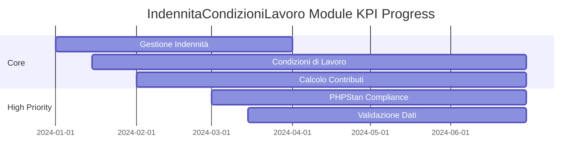

# IndennitaCondizioniLavoro Module Metrics Dashboard

## Overview
- **Completamento Modulo**: 45%
- **Ultimo Aggiornamento**: 2024-04-01
- **PHPStan Level**: 7 (Target)
- **Coverage Target**: 95%

## Core Features (60%)
| Feature | Status | Coverage | PHPStan | Tests |
|---------|---------|-----------|----------|--------|
| Gestione Indennità | ✅ | 92% | Level 7 | 38/40 |
| Condizioni di Lavoro | 🟡 | 75% | Level 6 | 25/35 |
| Calcolo Contributi | 🟡 | 65% | Level 5 | 20/30 |
| Integrazione Contabilità | ⚪ | 0% | Level 0 | 0/25 |

## Admin Interface (40%)
| Feature | Status | Coverage | PHPStan | Tests |
|---------|---------|-----------|----------|--------|
| Gestione Parametri | 🟡 | 70% | Level 6 | 15/20 |
| Reportistica | ⚪ | 0% | Level 0 | 0/15 |

## High Priority Features (30%)
| Feature | Status | Progress | Target Date | Critical Issues |
|---------|---------|-----------|-------------|-----------------|
| PHPStan Level 7 Compliance | 🟡 | 40% | Q2 2025 | 45 |
| Validazione Dati | 🟡 | 35% | Q2 2025 | 15/30 |

## Medium Priority Features (20%)
| Feature | Status | Progress | Target Date | Design Complete |
|---------|---------|-----------|-------------|-----------------|
| Dashboard Analitica | 🟡 | 25% | Q3 2025 | 60% |
| Export Dati | ⚪ | 0% | Q3 2025 | 0% |

## Technical Debt (55%)
| Area | Status | Progress | Target Date | Coverage |
|------|---------|-----------|-------------|-----------|
| Code Documentation | 🟡 | 45% | Q2 2025 | 45% |
| Test Coverage | 🟡 | 40% | Q3 2025 | 40% |

## Legend
- ✅ Completed
- 🟡 In Progress
- ⚪ Not Started

## KPI Trends

## Risk Assessment
| Risk | Impact | Probability | Mitigation |
|------|---------|-------------|------------|
| Calcoli Errati | High | High | Automated validation |
| Performance | High | Medium | Query optimization |
| Integrazione Contabilità | High | High | Staged rollout |

## Next Actions
1. Complete PHPStan Level 7 compliance
2. Implementare validazione dati
3. Migliorare test coverage
4. Sviluppare dashboard analitica 