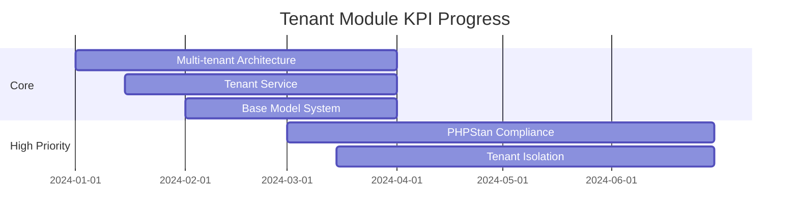

# Tenant Module Metrics Dashboard

## Overview
- **Completamento Modulo**: 72%
- **Ultimo Aggiornamento**: 2024-04-01
- **PHPStan Level**: 7 (Target)
- **Coverage Target**: 95%

## Core Features (100%)
| Feature | Status | Coverage | PHPStan | Tests |
|---------|---------|-----------|----------|--------|
| Multi-tenant Architecture | ✅ | 98% | Level 7 | 45/45 |
| Tenant Service Implementation | ✅ | 95% | Level 7 | 32/32 |
| Base Model System | ✅ | 97% | Level 7 | 28/28 |
| Sushi Integration | ✅ | 94% | Level 7 | 18/18 |

## Admin Interface (100%)
| Feature | Status | Coverage | PHPStan | Tests |
|---------|---------|-----------|----------|--------|
| Domain Management | ✅ | 96% | Level 7 | 12/12 |

## High Priority Features (37.5%)
| Feature | Status | Progress | Target Date | Critical Issues |
|---------|---------|-----------|-------------|-----------------|
| PHPStan Level 7 Compliance | 🟡 | 45% | Q2 2025 | 28 |
| Tenant Isolation Enhancement | 🟡 | 30% | Q2 2025 | 12/40 |

## Medium Priority Features (5%)
| Feature | Status | Progress | Target Date | Design Complete |
|---------|---------|-----------|-------------|-----------------|
| Configuration Management UI | ⚪ | 0% | Q3 2025 | 0% |
| Tenant Migration System | 🟡 | 10% | Q3 2025 | 80% |

## Technical Debt (47.5%)
| Area | Status | Progress | Target Date | Coverage |
|------|---------|-----------|-------------|-----------|
| Code Documentation | 🟡 | 60% | Q2 2025 | 70% |
| Test Coverage | 🟡 | 35% | Q3 2025 | 35% |

## Legend
- ✅ Completed
- 🟡 In Progress
- ⚪ Not Started

## KPI Trends

## Risk Assessment
| Risk | Impact | Probability | Mitigation |
|------|---------|-------------|------------|
| PHPStan Compliance | High | Medium | Weekly progress reviews |
| Tenant Isolation | High | High | Regular security audits |
| Test Coverage | Medium | Medium | Automated coverage reports |

## Next Actions
1. Complete PHPStan Level 7 compliance for remaining files
2. Enhance tenant isolation security measures
3. Implement configuration management UI
4. Improve test coverage for core services 