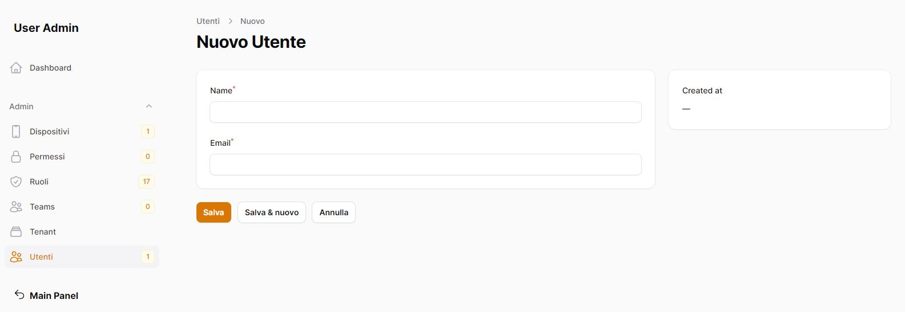
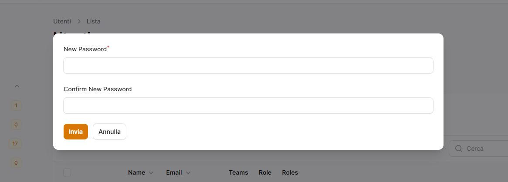
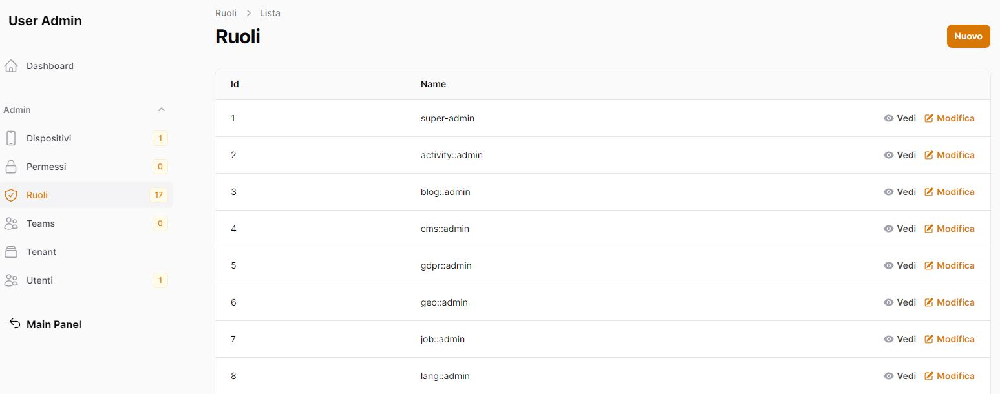

<<<<<<< HEAD
# Module User Fila3 🔥 Ultimate User, Roles & Permissions Manager for FilamentPHP 🚀

[](https://github.com/laraxot/module_user_fila3/releases)
[](https://travis-ci.org/laraxot/module_user_fila3)
[](https://codecov.io/gh/laraxot/module_user_fila3)
[](LICENSE)

Manage users, roles, and permissions with lightning speed ⚡ through this Laravel module, fully integrated with FilamentPHP. Designed for developers who want **full control** over their user management systems. **Empower your app** with dynamic user access control and module assignments. 🚀

### Key Features 🌟
- **Create Super Admin in Seconds**: Instantly make any user a super admin with `php artisan user:super-admin`. 🛡️
- **Dynamic Module Assignment**: Control user access to specific modules through `php artisan user:assign-module`. 🎯
- **Complete Team Management**: Manage teams with simple commands like `php artisan team:create` and `php artisan team:assign-user`. 👥
- **Permissions that Fit**: Set flexible roles and permissions to fit your app’s unique needs! 🔑

---

### Installation Guide 💻

1. **Install the package via Composer:**
    ```bash
    composer require laraxot/module_user_fila3
    ```

2. **Run Migrations:**
    ```bash
    php artisan module:migrate User
    ```

3. **Publish Config File:**
    ```bash
    php artisan vendor:publish --tag="module_user_fila3-config"
    ```

4. **Create First User:**
    ```bash
    php artisan make:filament-user
    ```

---

### Supercharged Console Commands 🚀

Leverage powerful artisan commands to boost your app’s user management capabilities:

- **Create Super Admin:**
    ```bash
    php artisan user:super-admin
    ```
    _Transform any user into an all-powerful super admin!_

- **Assign Modules:**
    ```bash
    php artisan user:assign-module
    ```
    _Dynamically assign or restrict modules for specific users._

- **Manage Teams:**
    - Create a team:
        ```bash
        php artisan team:create
        ```
    - Assign a user to a team:
        ```bash
        php artisan team:assign-user
        ```

- **View Available Modules:**
    ```bash
    php artisan module:list
    ```
    _See all available modules and activate/deactivate them at will._

---

### Configuration 🔧

Easily configure the module in the `module_user_fila3.php` config file to suit your app's specific needs.

### FAQ ❓

- **Q: How do I assign roles?**
  A: Use the Filament interface or `php artisan user:assign-module` command to assign roles and modules.

- **Q: Can I manage teams?**
  A: Absolutely! Use `php artisan team:create` to create new teams and `php artisan team:assign-user` to add users.

### Contribute 💪

We 💖 open source! Want to improve this package? Fork the repo and submit a pull request.

---

### Author 👨‍💻

Developed and maintained by [Marco Sottana](https://github.com/marco76tv)  
📧 Email: marco.sottana@gmail.com

---

### License 📄

This package is open-sourced under the [MIT license](LICENSE).

---

Give your Laravel app the **edge** it deserves with **Module User Fila3**. Try it now! 💥

=======
# 👤 User Module - Gestione Utenti Avanzata

[](https://php.net)
[](https://laravel.com)
[](LICENSE)
[](.codeclimate.yml)
[](phpunit.xml.dist)
[](docs/module_user.md)
[](https://filamentphp.com)
[](https://github.com/laraxot/module_user)
[](https://packagist.org/packages/laraxot/module_user)
[](https://github.com/laraxot/module_user)

<div align="center">
  
</div>

## 🇮🇹 Italiano

### 📝 Descrizione
Il modulo User fornisce un sistema completo di gestione utenti per applicazioni Laravel, con supporto per autenticazione, autorizzazione e profili utente avanzati.

### ✨ Caratteristiche Principali
- ✅ Autenticazione multi-fattore (2FA)
- ✅ Gestione ruoli e permessi
- ✅ Profili utente personalizzabili
- ✅ Interfaccia amministrativa Filament
- ✅ API RESTful per la gestione utenti
- ✅ Log attività utente
- ✅ Gestione sessioni
- ✅ Integrazione con social login

### 🚀 Installazione
```bash
composer require modules/user
php artisan module:enable User
php artisan migrate
```

### 📚 Documentazione
Consulta la [documentazione completa](docs/module_user.md) per:
- [Autenticazione](docs/authentication.md)
- [Autorizzazione](docs/authorization.md)
- [API](docs/api.md)

## 🇬🇧 English

### 📝 Description
The User module provides a complete user management system for Laravel applications, with support for authentication, authorization, and advanced user profiles.

### ✨ Key Features
- ✅ Multi-factor authentication (2FA)
- ✅ Role and permission management
- ✅ Customizable user profiles
- ✅ Filament admin interface
- ✅ RESTful API for user management
- ✅ User activity logging
- ✅ Session management
- ✅ Social login integration

### 🚀 Installation
```bash
composer require modules/user
php artisan module:enable User
php artisan migrate
```

### 📚 Documentation
Check out the [complete documentation](docs/module_user.md) for:
- [Authentication](docs/authentication.md)
- [Authorization](docs/authorization.md)
- [API](docs/api.md)

## 🇪🇸 Español

### 📝 Descripción
El módulo User proporciona un sistema completo de gestión de usuarios para aplicaciones Laravel, con soporte para autenticación, autorización y perfiles de usuario avanzados.

### ✨ Características Principales
- ✅ Autenticación multi-factor (2FA)
- ✅ Gestión de roles y permisos
- ✅ Perfiles de usuario personalizables
- ✅ Interfaz administrativa Filament
- ✅ API RESTful para gestión de usuarios
- ✅ Registro de actividad de usuarios
- ✅ Gestión de sesiones
- ✅ Integración con login social

### 🚀 Instalación
```bash
composer require modules/user
php artisan module:enable User
php artisan migrate
```

### 📚 Documentación
Consulta la [documentación completa](docs/module_user.md) para:
- [Autenticación](docs/authentication.md)
- [Autorización](docs/authorization.md)
- [API](docs/api.md)

## 🤝 Contribuire / Contributing / Contribuir

Siamo aperti a contribuzioni! Consulta le nostre [linee guida per i contributori](.github/CONTRIBUTING.md).

We are open to contributions! Check out our [contributor guidelines](.github/CONTRIBUTING.md).

¡Estamos abiertos a contribuciones! Consulta nuestras [pautas para contribuidores](.github/CONTRIBUTING.md).

## 📄 Licenza / License / Licencia

Questo progetto è distribuito sotto la licenza MIT. Vedi il file [LICENSE](LICENSE) per maggiori dettagli.

This project is distributed under the MIT license. See the [LICENSE](LICENSE) file for more details.

Este proyecto está distribuido bajo la licencia MIT. Ver el archivo [LICENSE](LICENSE) para más detalles.
>>>>>>> origin/dev

# Module users
Gestione degli utenti, ruoli, permessi tramite l'utilizzo di filament.

## Gestione degli utenti




## Gestione dei ruoli



## Aggiungere Modulo nella base del progetto
Dentro la cartella laravel/Modules

```bash
git submodule add https://github.com/laraxot/module_user_fila3.git User
```

## Verificare che il modulo sia attivo
```bash
php artisan module:list
```
in caso abilitarlo
```bash
php artisan module:enable User
```

## Eseguire le migrazioni
```bash
php artisan module:migrate User
```

## Creare il primo account
Dalla documentazione di filament utilizziamo:
```bash
php artisan make:filament-user
```
l'account non potrà visualizzare nulla nella dashboard di amministrazione, in quanto non avrà assegnato nessun ruolo.

## Rendere un account Super Admin
```bash
php artisan user:super-admin
```
Ora avete il vostro account Super Admin per poter iniziare.
Esso potrà accedere a tutti i moduli nell'amminstrazione.

## Assegnare un ruolo/modulo
```bash
php artisan user:assign-module
```
L'account potrà accedere al modulo assegnato.

## [Gestione dei Team](docs/teams.md)
